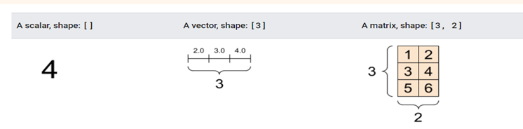
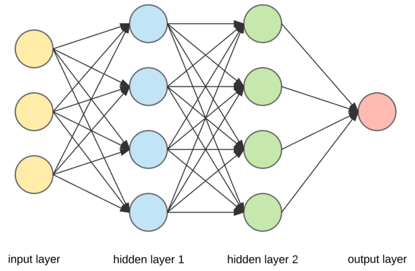
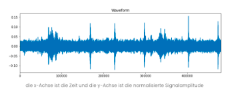
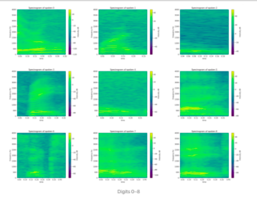
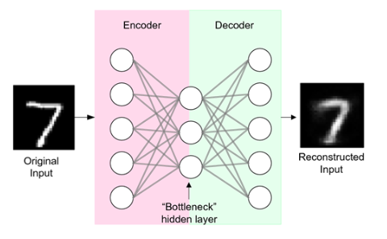
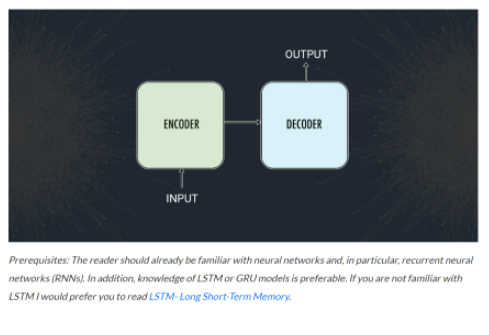
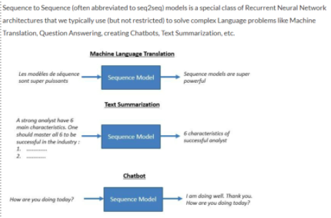
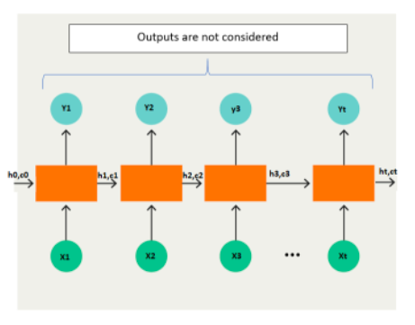
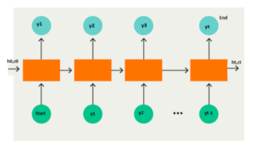
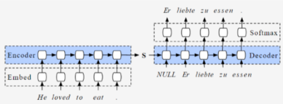

## Erläuterung Vorgehensweise CHALLENGE 2

**Theoretische Grundlagen:**

Mit Hilfe eines neuronalen Netzwerks, ist es möglich, einer Maschine etwas
anzutrainieren. Dieses besteht aus zwei wesentlichen Bestandteilen:

-   Neuron: Ein Knoten mit Gewichtung, Bias und Aktivierungsfunktion, mit dem
    berechnet wird, ob das Neuron “feuert”. Beispiele für Aktivierungsfunktionen
    sind RELU, Sigmoid und Tanh.

-   Layer: Eine Sammlung von Neuronen. Dabei unterscheidet man zwischen Input-,
    Output, und Hiddenlayer. Verfügt das Netzwerk über mehr als ein Hiddenlayer,
    spricht man von deep learning.

Das Erstellen eines neuronalen Netzwerks kann beispielweise mit TensorFlow und
Keras erfolgen. TensorFlow ist ein Framework und Keras die Bibliothek, die eine
Schnittstelle bereitstellt.

In der Dokumentation von TensorFlow gibt es bereits einen beschriebenen
Anwendungsfall, bei dem versucht wird Musik zu erzeugen. Dafür wird ein RNN
aufgebaut, mit dem ein Modell trainiert auf Basis von Piano MIDI Files.

In einem anderen Anwendungsfall wird mit der LSTM Architektur und einem RNN ein
Modell trainiert, welches Musik generieren kann. Für das Training wird ein
Datensatz von tausenden Irischen Volkslieder verwendet, das in der ABC Notation
vorliegt.

Pydub wurde im Verlauf der Entwicklung für das Zerstückeln ausgewählt, damit ein
stochastischer Ansatz implementiert werden konnte. Hierbei wird anhand von
leisen stellen (definierbar) ein Teilen der Audio Datei vorgenommen. Pydub
ermöglicht weitere Audio manipulationen in Form von Faden, Lautsärkeänderung
etc.

Für das aufteilen in gleich große Stücke wurde die SciPy Bibliothek verwendet.
Der User kann Anhand einer Eingabe die fixe größe der Samples auswählen. SciPy
basiert auf NumPy und wandelt die Audio Daten in ein zahlenbasiertes Format.

-   Die Verwaltung und Dokumentation der Arbeitsschritte finden über GitHub
    statt.

-   Für zusätzliche textuelle Beschreibungen werden Mark-Down-Files verwendet.

-   Die Software Struktur wird mit Hilfe von Unified Modeling Language (UML)
    dargestellt. Hierfür wurden Klassendiagramme, Use Case Diagramme sowie ein
    Komponentendiagramm erstellt. Diese wurden mit der Software StarUML
    erstellt. Die Modellierung der Diagramme stützt sich auf die Literatur von
    Oestereich et al. (Analyse und Design mir der UML 2.5).

**Tensoren** :

Tensoren sind die Datenstruktur, die von maschinellen Lernsystemen verwendet wird. Sie wird als eine Art Container von numerischen Daten angesehen. Ein Tensor hat drei typische **Eigenschaften** : range (Bereich), shape (Form), dtype (Datentyp).

Die Form eines Tensors bezieht sich auf die Anzahl der Dimensionen entlang jeder Achse. Der Datentyp des Tensors ist durch die enthaltenen Datentypen definiert Bsp.: (float32, float64, uint8, int32, int64)

Aufbau eines Tensors:

tensor.shape(3,4) -> enthält 3 Zeilen mit je 4 Werten

([[2, 10, 20, 22], 
 [8, 16, 32, 64], 
 [5, 10, 15, 20]])

Algorithmen für maschinelles Lernen verarbeiten jeweils eine Teilmenge von Daten (Charge). Bei der Verwendung eines Datensatzes ist die erste Achse des Tensors für die Größe des Loses (Anzahl der Stichproben) reserviert.

Quellen:

[Introduction to Tensors | TensorFlow Core](https://www.tensorflow.org/guide/tensor)

[Easy TensorFlow - 2- Tensor Types (easy-tensorflow.com)](https://www.easy-tensorflow.com/tf-tutorials/basics/tensor-types)

[TensorFlow Basics: Tensor, Shape, Type, Sessions &amp; Operators (guru99.com)](https://www.guru99.com/tensor-tensorflow.html#:~:text=A%20tensor%20is%20a%20vector,the%20result%20of%20a%20computation.)

**Model:**

**Normalization:**

Quellen:

[Different Types of Normalization in Tensorflow | by Vardan Agarwal | Towards Data Science](https://towardsdatascience.com/different-types-of-normalization-in-tensorflow-dac60396efb0)

**Input Datentypen Tensorflow:**

**Layer in einem künstlichen neuronalen Netzwerk (KNN):** 

Verschiedene Layer führen unterschiedliche Transformationen an ihren Eingaben durch und einige Layer sind für bestimmte Aufgaben besser geeignet als andere. 
So wird beispielsweise ein convolutional in der Regel in Modellen verwendet, die mit Bilddaten arbeiten. Recurrent Layer werden in Modellen verwendet, die mit Zeitreihendaten arbeiten und fully connected Layer verbinden jede Eingabe vollständig mit jeder Ausgabe innerhalb ihres Layers.

Beispiel für ein Artificial Neural Network: 

Hier sieht man, dass der erste Layer, der Input Layer aus drei Knoten (auch Neuronen genannt) besteht. Daraus ergibt sich, dass das Sample aus unserem Datensatz aus drei Dimensionen besteht. Jeder der drei Neuronen in diesem Layer repräsentiert ein einzelnes Feature aus einem bestimmten Sample unseres Datensatzes.  
Jeder der drei Input-Neuronen ist mit jedem Neuron im nächsten Layer verbunden. Jede Verbindung zwischen dem ersten Layer und dem zweiten Layer überträgt die Ausgabe des vorherigen Neurons an den Eingang des empfangenden Neurons (von links nach rechts). Die beiden Layer in der Mitte mit jeweils vier Neuronen sind Hidden Layer, weil sie zwischen dem Input und Output Layer angeordnet sind. 
Die Information wird also durch die Input-Neuronen aufgenommen und durch die Output-Neuronen ausgegeben. Die Hidden-Neuronen liegen dazwischen und bilden innere Informationsmuster ab. Die Neuronen sind miteinander über sogenannte Kanten verbunden. Je stärker die Verbindung ist, desto größer die Einflussnahme auf das andere Neuron. 

Input Layer: Der Input layer versorgt das neuronale Netz mit den notwendigen Informationen. Die Input-Neuronen verarbeiten die eingegebenen Daten und führen diese gewichtet an die nächste Schicht weiter.   

Hidden Layer: Der Hidden Layer befindet sich wie bereits erwähnt zwischen dem Input Layer und dem Output Layer. Während der Input Layer und Output Layer lediglich aus einer Ebene bestehen, können beliebig viele Ebenen an Neuronen im Hidden Layer vorhanden sein. Hier werden die empfangenen Informationen erneut gewichtet und von Neuron zu Neuron bis zum Output Layer weitergereicht. Die Gewichtung findet in jeder Ebene des Hidden Layers statt. Die genaue Prozessierung der Informationen ist jedoch nicht sichtbar. Daher stammt auch der Name, Hidden Layer. Während im Input und Output Layer die eingehenden und ausgehenden Daten sichtbar sind, ist der innere Bereich des Neuronalen Netzes im Prinzip eine Black Box. 

Output Layer: Der Output Layer ist der letzte Layer und schließt unmittelbar an die letzte Ebene des verborgenen Layer an. Die Output-Neuronen beinhalten die resultierende Entscheidung, die als Informationsfluss hervorgeht. 

**Wie funktioniert ein KNN?**

Deep Learning ist eine Hauptfunktion eines KNN und funktioniert wie folgt: Bei einer vorhandenen Netzstruktur bekommt jedes Neuron ein zufälliges Anfangsgewicht zugeteilt. Dann werden die Eingangsdaten in das Netz gegeben und von jedem Neuron mit seinem individuellen Gewicht gewichtet. 
Das Ergebnis dieser Berechnung wird an die nächsten Neuronen des nächsten Layer weitergegeben, man spricht auch von einer „Aktivierung der Neuronen“. Eine Berechnung des Gesamtergebnisses geschieht am Output Layer. 
Natürlich sind, wie bei jeder maschinellen Lern-Methode, nicht alle Ergebnisse (Outputs) richtig und es kommt zu Fehlern. Diese Fehler sind berechenbar, ebenso wie der Anteil, den ein einzelnes Neuron an dem Fehler hatte. So wird im nächsten Lern-Durchlauf das Gewicht jedes Neurons so verändert, dass man den Fehler minimiert. 
Anschließend kommt der nächste Durchlauf, indem eine neue Messung des Fehlers nebst Anpassung geschieht. Auf diese Weise „lernt“ das neuronale Netz mit jedem Mal besser, von den Inputdaten auf bekannte Outputdaten zu schließen. 

 

**Convolutional Neural Networks (CNN):**

Convolutional Neural Networks (CNN), sind Künstliche Neuronale Netzwerke, die besonders effizient mit 2D- oder 3D-Eingabedaten arbeiten können. Für die Objektdetektion in Bildern verwendet man insbesondere CNNs. 
Der große Unterschied zu den klassischen Neuronalen Netzen besteht in der Architektur von CNNs und damit kann auch der Name „Convolution“ oder „Faltung“ erklärt werden. Der Hidden Layer basiert bei CNNs auf einer Abfolge von Convolution- und Poolingoperationen. Bei der Convolution wird ein so genanntes Kernel über die Daten geschoben und währenddessen eine Faltung gerechnet, was vergleichbar mit einer Multiplikation ist. Die Neuronen werden aktualisiert. Die anschließende Einführung eines Poolinglayers sorgt dafür, dass die Ergebnisse vereinfacht werden. Nur die wichtigen Informationen bleiben anschließend erhalten. Dies sorgt zudem dafür, dass die 2D- oder 3D-Eingangsdaten kleiner werden. Wird dies immer weiter fortgeführt, ergibt sich am Ende in der Ausgabeschicht ein Vektor, der „fully connected layer“. Dieser hat vor allem in der Klassifikation eine besondere Bedeutung, da er so viele Neuronen wie Klassen enthält und die entsprechende Zuordnung über eine Wahrscheinlichkeit bewertet. 

**Recurrent Neural Networks (RNN):** 

Recurrent Neural Networks (RNN) fügen den KNN wiederkehrende Zellen hinzu, wodurch neuronale Netze ein Gedächtnis erhalten. Es ist eine Art von künstlichem neuronalem Netz, das sequentielle Daten oder Zeitreihendaten verwendet. Diese Art von Neuronal Networks wird insbesondere dann verwendet, wenn der Kontext wichtig ist. Denn dann beeinflussen Entscheidungen aus vergangenen Iterationen oder Proben maßgeblich die aktuellen. Mithilfe der Verschaltungen ist es möglich, aus einer Menge von Ausgangsdaten zeitlich codierte Informationen zu gewinnen. Da Recurrent Neural Networks jedoch den entscheidenden Nachteil haben, dass sie über die Zeit instabil werden, ist es inzwischen gang und gäbe so genannte Long Short-Term Memory Units (LSTMs) zu verwenden. Diese stabilisieren das RNN auch für Abhängigkeiten, die über einen längeren Zeitraum bestehen. 

Quellen:

https://deeplizard.com/learn/video/FK77zZxaBoI

https://towardsdatascience.com/everything-you-need-to-know-about-neural-networks-and-backpropagation-machine-learning-made-easy-e5285bc2be3a

https://datasolut.com/neuronale-netzwerke-einfuehrung/

**Spektrogramme:**

Bei der ausführlichen Recherche zu CNN sind wir sehr oft auf das Klassifizieren von Audio Daten mithilfe von Spektrogrammen gestoßen. Diesen Ansatz verfolgten wir schließlich für einige Zeit.  

(Bis zu dem Zeitpunkt als Prof. Dr. Kunz in einem Fachgespräch von diesem Ansatz abriet). 

Wie bereits erwähnt, wird das Convolutional Neural Network hauptsächlich für die Objektdetektion in Bildern verwendet. Daher stammt die Idee Audio Daten in eine Art Bilder umzuwandeln. 

Normalerweise sind Audiodateien im “.wav”-Format, diese gelten allgemein als Wellenform. Eine Wellenform stellt eine Zeitreihe mit einer Signalamplitude zu jedem Zeitpunkt dar. Wenn wir einen dieser Wellenform-Samples visualisieren, erhalten wir so etwas: 

Nun verfolgt dieser Ansatz die Idee diese Wellenform-Samples in Spektrogramme umzuwandeln. 

Ein Spektrogramm ist eine bildliche Darstellung des wellenförmigen Signals. Es zeigt dessen Frequenzintensitätsbereich im Zeitverlauf und kann sehr nützlich sein, wenn die Frequenzverteilung des Signals im Zeitverlauf bewertet werden soll.  

Spektrogramme stellen also den Frequenzinhalt des Tons als Farben in einem Bild dar. Der Frequenzinhalt von Millisekunden-Blöcken wird als farbige vertikale Balken aneinandergereiht. Im Grunde genommen sind Spektrogramme zweidimensionale Diagramme, wobei eine dritte Dimension durch Farben dargestellt wird. Nachdem die Samples in Spektrogramme umgewandelt werden, soll das CNN Muster in den entstandenen Bildern erkennen. 

Quellen:

https://towardsai.net/p/l/a-gentle-introduction-to-audio-classification-with-tensorflow 

https://www.kaggle.com/code/dimitreoliveira/rainforest-audio-classification-tf-improved/notebook 

https://www.kaggle.com/code/christianlillelund/classify-mnist-audio-using-spectrograms-keras-cnn/notebook 

https://medium.com/x8-the-ai-community/audio-classification-using-cnn-coding-example-f9cbd272269e 

**Encoder-Decoder Modelle (LSTM):**

RNN (Recurrent Neural Networks), wie das LSTM (Long-Short-Time Memory) sind speziell für die Verarbeitung von Eingabedatenfolgen konzipiert worden. 

RNN’s sind in der Lage die Dynamik innerhalb einer zeitlichen Abfolge von Eingabesequenzen zu erlernen und einen internen Speicher zu nutzen, um diese Informationen über lange Eingabesequenzen hinweg zu speichern oder zu verwenden. 

Das LSTM Netzwerk kann hierbei in einer in einer Decoder-Encoder-LSTM Architektur abgebildet werden. Dieses Modell kann genutzt werden, um Eingabesequenzen variabler Länge anzuzeigen sowie zur Vorhersage oder Ausgabe von Ausgabesequenzen variabler Länge. 

Diese Architektur ist Grundlage für komplexe Sequenzvorhersageprobleme wie Spracherkennung und Textübersetzung. 

**Autoencoder:**

Unter einem Autoencoder versteht man ein neuronales Netzwerk Modell, welches versucht, die komprimierte Darstellung einer Eingabe (Input) wiederzugeben. Außerdem können Autoencoder zur Rekonstruktion einer verrauschten Eingabe genutzt werdenHierbei handelt es sich um eine Unsupervised Learning Methode.  

Autoencoder bestehen aus einem Kodierungs (Encode) und einem Dekodierungsmechanismus (Decode). Der Kodierer (Encoder) ist für die Reduzierung (Komprimierung) der eingegeben Daten zuständig. Der Dekodierer (Decoder) rekonstruiert die komprimierten Daten in die bestmögliche Darstellung der Eingabe. Die Herausforderung des Autoencoders liegt darin, die Daten auf den in der Mitte des Modells gegebenen Engpasses (Bottleneck) zu rekonstruieren. 

**Warum Autoencoder für unseren Ansatz?**

Autoencoder werden genutzt, um Informationen in einer kleineren Dimension darzustellen. Die Idee dahinter war, ein neuronales Netz zu benutzen, welches Signale bereinigen oder rekonstruieren kann. Dies wäre hilfreich in späteren Schritten die Musik für das Online-Streaming zu komprimieren. Beispielsweise gebe es somit die Möglichkeit einen generierten Musik-Streaming-Dienst zu erstellen, welcher verlustfreie Musik liefert, ohne dabei viel Bandbreite zu beanspruchen. Man könnte den Encoder verwenden, um die Musik auf dem Server zu komprimieren, die komprimierte Audio an den Client zu streamen und dann den Decoder zu verwenden, um die Audio auf der Clientseite zu dekomprimieren. 

Im Rahmen unserer Aufgabenstellung wurde dieser Ansatz für den Anfang verworfen, da dieser zu weit vorgreift. Eventuell wird der Ansatz aufgenommen, sobald der Streaming Dienst steht und die Daten zu groß sind. Dieser Ansatz würde helfen die Daten zu komprimieren und somit mehr Musik anbieten zu können. 

Quellen:

https://kuldeepsangwan.medium.com/journey-through-sequence-to-sequence-models-attention-and-transformer-56365c32e99e 

https://www.youtube.com/watch?v=xwrzh4e8DLs&t=6s 

https://machinelearningmastery.com/encoder-decoder-long-short-term-memory-networks/ 

**Sequence to Sequence Modell:**

Wird für Sequenzen verwendet wie Sätze, um eine Klasse vorherzusagen für jedes Wort im Satz. Kann dazu verwendet werden, um Reihenfolgen auf Reihenfolgen abzubilden. Es wird ein LSTM verwendet um die Eingabesequenz auf einen Vektor einer festen Dimensionalität abzubilden. Ein weiteres tieferes LSTM wird dazu genutzt um die Zielsequenz aus dem Vektor zu dekodieren. In den meisten Beispielen wird es verwendet um Wörter in Sätzen zu klassifizieren und die Wortreihenfolge zu erlernen. Durch das Umkehren der Wortreihenfolge in den Eingangsdaten (nicht den Zieldaten) hat eine sehr positive Wirkung auf die Leistung des LSTM. Dies liegt daran, dass die vielen kurzfristigen Abhängigkeiten zwischen Input und Output Zieldaten eingefügt wurden.  

**Encoder:**

Der Encoder ist ein LSTM model, welcher die input Sequenz liest und die Informationen in einen internen Zustandsvektor/Kontextvektor zusammenfasst. Danach nur die internen Zustände aufbewahrt, die restlichen Informationen werden verworfen. Der Kontextvektor wird dazu verwendet alle Eingabeelemente zu kapseln, um den Decoder zu helfen eine genaue Vorhersage zu treffen.  

LSTM liest die Daten in 't' Zeitschritten. X1 = Eingabesequenz zum Zeitschritt 1. Das LSTM behält zwei Zustände bei (“h” für den verborgergenen Zustand und “c” für den Zellzustand). Beide zusammen bilden die internen Zustände des LSTM Netzwerkes ab zum jeweiligen Zeitschritt ab. 

**Decoder:**

Der Decoder ist ebenfalls ein LSTM, er initialisiert die Eingangszustände des Encoder-LSTM´s mit seinen Anfangszuständen. Im Detail wird der Kontextvektor der letzten Zelle des Encoders in die erste Zelle des Decoder Netzwerkes eingetragen. Mit diesen Anfangszuständen startet der Decoder mit der Generierung der Ausgabensequenz. Die Ausgaben werden wiederum für zukünftige Ausgaben betrachtet. Ein Stapel aus mehreren LSTM Einheiten sagt zu jedem Zeitschritt t eine Ausgabe (y1, y2..) vorher. Jede vorherige Einheit wird durch eine rekurrente Einheit adaptiert und erzeugt eine Ausgabe sowie ihren eigenen versteckten Zustand. Softmax wird verwendet, um einen Wahrscheinlichkeitsvektor zu erstellen, der uns hilft, die endgültige Ausgabe zu bestimmen. 

Beispiel: 

"START_ John ist hart arbeitend _END". 

 Der wichtigste Punkt ist, dass die Anfangszustände (h0, c0) des Decoders auf die Endzustände des Encoders gesetzt werden. Dies bedeutet intuitiv, dass der Decoder darauf trainiert wird, die Ausgabesequenz in Abhängigkeit von den vom Encoder kodierten Informationen zu erzeugen. 

Schließlich wird der Verlust anhand der vorhergesagten Ausgänge aus jedem Zeitschritt berechnet, und die Fehler werden durch die Zeit zurückverfolgt, um die Parameter des Netzes zu aktualisieren. Das Training des Netzes über einen längeren Zeitraum mit einer ausreichend großen Datenmenge kann zu guten Vorhersagen führen. 

1. Während der Inferenz wird ein Wort nach dem anderen erzeugt. 

2. Die Anfangszustände des Decoders werden auf die Endzustände des Encoders gesetzt. 

3. Die anfängliche Eingabe für den Decoder ist immer das START-Token. 

4. Bei jedem Zeitschritt werden die Zustände des Decoders beibehalten und als Anfangszustände für den nächsten Zeitschritt festgelegt. 

5. Bei jedem Zeitschritt wird die vorhergesagte Ausgabe als Eingabe für den nächsten Zeitschritt verwendet. 

6. Wir unterbrechen die Schleife, wenn der Decoder das END-Token vorhersagt. 

Quellen:

https://towardsdatascience.com/solving-nlp-task-using-sequence2sequence-model-from-zero-to-hero-c193c1bd03d1 

https://www.cl.cam.ac.uk/teaching/2021/L101/slides6.pdf 

https://arxiv.org/abs/1409.3215 

https://github.com/Pankajchandan/sequence2sequence 

https://machinelearningmastery.com/define-encoder-decoder-sequence-sequence-model-neural-machine-translation-keras/ 

https://nlp.stanford.edu/~johnhew/public/14-seq2seq.pdf 

https://blog.keras.io/a-ten-minute-introduction-to-sequence-to-sequence-learning-in-keras.html 

https://www.analyticsvidhya.com/blog/2020/08/a-simple-introduction-to-sequence-to-sequence-models/ 

https://kuldeepsangwan.medium.com/journey-through-sequence-to-sequence-models-attention-and-transformer-56365c32e99e 

