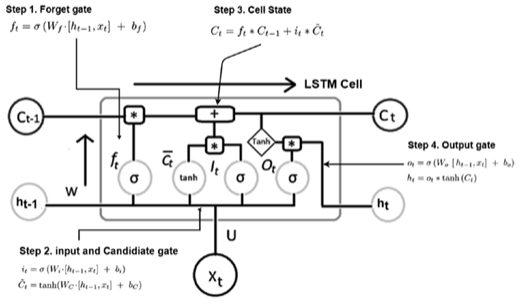
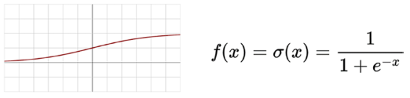
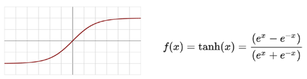
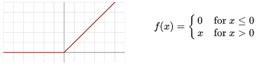
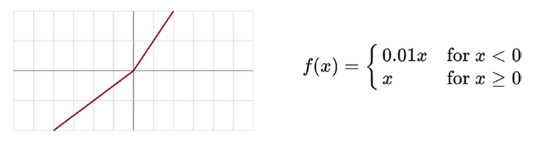
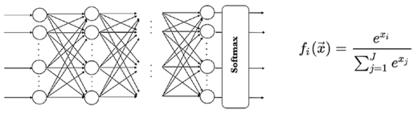

## Theoretische Grundlagen 

 

### Convolutional Neural Networks (CNN)
Unter einem CNN (Convolutional Neural Network) versteht man ein spezielles Feed-Forward-Netz. Mit Hilfe eines CNNs können große Mengen an Eingabedaten, die beispielsweise bei der Bilderkennung anfallen verarbeitet werden. Hierbei werden Daten verwendet, welche in einer Gitterstruktur abgebildet werden können. Gitterstrukturen findet man in Bildern sowie Zeitreihen. Unter einer Faltung (engl. Convolutional) versteht man eine lineare Operation, welche anstatt der sonst üblichen Matrix-Vektor-Multiplikation, für CNNs verwendet wird. Sobald diese mathematische Operation in mindestens einem Layer vorhanden ist spricht man von einem Convolutional Neural Network. Wie bereits erwähnt besteht eine übliche Architektur für ein CNN besteht aus einem Stack von Convolutional- und Pooling-Schichten, gefolgt von Dense Layern.  Das Netzwerk erkennt Bildverzerrungen und andere optische Veränderungen und berücksichtigt diese bei der Verarbeitung. Durch die Pooling-Schichten werden Informationen zu den gescannten Features verdichtet. Das Flattening wandelt die Daten wieder in einen Vektor um. Somit werden jeweils die stärksten Features herausgefiltert und die schwachen verworfen. Diese selbst generierten Merkmale nutzt das Multilayer Perception. (Frochte, 2020)	 

 

### LSTM
Das Long short-term-memory (LSTM) behandelt insbesondere die Probleme des explodierenden und verschwindenden Gradienten. 
Das LSTM ist eine bestimmte Art eines rekurrenten neuronalen Netzes. Eines der Hauptprobleme eines RNN’s ist, dass dieses nur die Informationen über den vorherigen Zustand speichert, was den verschwindenden Gradienten verursacht. Das LSTM löst dieses Problem. Alle RNN’s haben sich wiederholende Kettenmodule des neuronalen Netzes. Diese wiederholende Struktur ist eine einfache Struktur wie beispielweise ein simples Dense Layer mit einer tanH Aktivierungsfunktion in einem RNN. Das LSTM hat eine identische Verkettungsstruktur anstelle einer neuronalen Netzwerkschicht.  
 

  

Abbildung 1: RNN vs. LSTM, Quelle: Vishwas & Patel, 2020, Seite 211 
 
 
Das LSTM hat im Gegensatz zu einem herkömmlichen RNN folgende zusätzliche Eigenschaft, die als Memory (dt. Gedächtnis) bezeichnet wird: 

-Forget gate (ein neuronales Netz mit Sigmoid Aktivierung σ) 

-Candidate Layer (ein neuronales Netz mit tanH-Aktivierung) 

-Input gate (ein neuronales Netz mit Sigmoid Aktivierung) 

-Output gate  (ein neuronales Netz mit Sigmoid Aktivierung) 

-Hidden state  

-Memory Cell (Zellstatus)  
 

### Schritt für Schritt Erläuterung einer LSTM Zelle:  

Ht-1 ist der Hiden State Vektor der vorherigen Zelle. Hat ist der generierte Hiden State der aktuellen Zelle 

Ct-1 repräsentiert den Zellstatus der vorherigen Zelle. C ist für das Langzeitgedächtnis, sprich das Speichern von längerfristigen Abhängigkeiten und Mustern.  

#### Step 1 (Forget gate):  

Im ersten Schritt wird das Forget Gate betrachtet. Hierbei (siehe Abbildung 2 – Step 1. Forget Gate: Formel) steht ft  für die Forget Matrix für t. Diese Matrix stellt die Lösung für das Forget Gate dar. Zuerst wird der Input xt im aktuellen Zeitschritt mit h t-1 verkettet []. Auf diese Verkettung wird die Sigmoid Funktion 
σ
angewandt. Daraufhin wird bf  (Bias) addiert. Zuletzt wird Wf angewendet, welches die Weight Matrix dieses Dense Layers darstellt. Sobald diese Formel ausgeführt wurde, wird die eine Forget Matrix erzeugt, welche als Filter fungiert um bestimmte Informationen zu vergessen. Die Sigmoid Funktion wird verwendet, da sie einen großen Eingaberaum in einen kleinen Eingaberaum zwischen 0 und 1 presst. Dies ist vorteilhaft als Filter, da die Werte in dieses Intervall gedrängt werden. Die Indizes die näher am Wert 0 stehen, sind die relativen Indizes welche im Zellstatus vergessen (forget) werden. Indizes welche einen Wert nahe 1 haben werden behalten. Somit werden Werte die in einer Matrix mit 0 multipliziert werden verworfen.  

Im Schritt 1.2 wird der alte Zellstatus Ct-1 mit dem neu generierten ft multipliziert. Formel: Cft = Ct-1 * ft  .  

Beispiel:    

Ct-1 = [1,2,4] 

 Ft = [1,0,1] 

Cft = [1,2,4] *[1,0,1] = [1,0,4] 

Somit wird der erste Index und der dritte Index behalten und der mittlere Index da = 0 verworfen. 
 

#### Step 2 (Input and Candidate gate): 

Im zweiten Schritt wird das Input-, sowie das Candidate gate miteinander multipliziert. Das Ergebnis dieser Multiplikation wird dann mit der Information aus Schritt 1.2 addiert. 

Zuerst wird das Inputgate it erstellt (siehe Abbildung 2 –Step 2. input and candidate gate – 1. Formel).  Die Lösung des Input Gates wird als Matrix dargestellt und dient als Filter für die simple RNN Komponente (tanH). Hierbei hat die erzeugte Matrix it dieselbe Dimensionalität wie das Ergebnis der tanH Schicht, damit diese kompatibel sind. Um diese Dimensionalität zu erzeugen wird wieder eine Sigmoid Funktion auf die Verkettung von [h t-1 , xt ] wie im ersten Schritt angewendet und mit Wi multipliziert und Bias addiert. 

Der Candidate Gate Ć (siehe Abbildung 2 –Step 2. input and candidate gate – 2. Formel) dient als neuer Zellstatus welche die Funktion des vorherigen Zeitschritts beinhaltet. Jedoch wird dieses Mal nicht mit einer Sigmoid Funktion multipliziert, sondern mit einer tanH Aktivierungsfunktion.  

Die beiden Ergebnisse des Candidate Gate und des Input Gates werden anschließend multipliziert. Hierbei entscheidet das it welche Informationen wichtig und filtert diese aus. Somit ist C der Zellstatus zu einer bestimmten Zeit t mit gefilterten Inputs. 

Cit = Ćt *it 

#### Schritt 3 (Zellstatus):  

Der Zellstatus Ct des aktuellen Zeitschritts setzt sich somit aus Ct= Cft + Cit zusammen. Cft zeigt an welche Informationen aus dem vorherigen Zellstatus vergessen werden sollen und Cit fügt den neuen aktuellen Input hinzu.  

#### Schritt 4 (Output Gate): 

Im Output Filter Ot wird die Output Matrix generiert. Auch bei dieser wird wieder die Sigmoid Funktion angewendet, die bereits in Step 1 und Step 2 vorkam (siehe Abbildung 2 –Step 2. input and candidate gate – 1. Formel). H t ist der Hidden State für den jetzigen Zeitschritt, sowie dem Output. Um h t zu generieren wird ot mit dem Zellstatus, durchlaufen von tanH, tanH(Ct) multipliziert. TanH fungiert hier nicht als Layer, sondern ist nur die Funktion an sich. TanH wird verwendet, da auch diese Funktion die Werte zwischen - 1 und 1. H t wird als Hidden State für den jetzigen zeitschritt verwendet und als dense layer für die Vorhersage verwendet.  

 

 
  
Abbildung 2:  LSTM Zelle mit Formeln, Quelle: Vishwas & Patel, 2020, Seite 212

 

### Layers  

 

Im Folgenden werden unterschiedliche Schichten in einem Neuronalen Netz erläutert und vorgestellt. 

#### Convolutional Layer  

Diese erste Schicht analysiert die eingegebenen Informationen und erkennt das Vorhandensein einer Reihe von Merkmalen. Das Convolutional Layer erzeugt eine Faltung über eine einzige räumliche oder zeitliche Dimension. Der Input Shape beschränkt sich auf die Anzahl der Elemente innerhalb einer Dimension.  

#### LSTM-Layer  

LSTM-Layer sind rekurrente neuronale Netze, die eine Sequenz als Input annehmen und entweder Sequenzen (return_sequences=True) oder eine Matrix zurückgeben können. (siehe Beschreibung zu LSTM) 

#### Dropout Layer  

Dropout-Layer sind eine Regularisierungstechnik, die darin besteht, bei jeder Aktualisierung während des Trainings einen Teil der Input unit auf 0 zu setzen. Dadurch soll Overfitting verhindert werden. Dieser Anteil der Input units, die auf 0 gesetzt werden sollen, wird durch einen Parameter bestimmt. 

#### Max Pooling Layer  

Das Max Pooling ist ein Beispiel-basierter Diskretisierungsprozess. Hierbei wird die Eingabe (Bild, Hidden Layer Ausgangsmatrix) abgetastet, um die Dimensionalität zu reduzieren. Somit werden die zu erlernenden Parameter, sowie der Rechenaufwand reduziert. 

#### Dense Layer  

Alle Neuronen sind mit allen Inputs und Outputs verbunden. Enthält die Anzahl der Outputs. Bei einem Dense Layer sind vollständig verbundene neuronale Netzwerkschichten, bei denen jeder Eingangsknoten mit jedem Ausgangsknoten verbunden ist. Die Aktivierungsfunktion des neuronalen Netzes zur Berechnung der Ausgabe eines Knotens verwenden wird. (Skúli, 2018) 

 

### Aktivierungsfunktionen  

 

Die Aktivierungsfunktion ist eine mathematische Formel / Funktion, welche den Output des Models angibt. Das Ergebnis dieser Funktion liegt meist zwischen 0 bis 1 oder –1 bis 1. Die Funktion wird verwendet, damit den Neuronen nichtlineare Funktionen hinzugefügt werden können. Somit kann sich das neuronale Netz jeder nichtlinearen Funktion nähern und auf nichtlineare Modelle angewendet werden. Wenn die Aktivierungsfunktion nicht benutzt wird, ist die Ausgabe einer jeden Schicht eine lineare Funktion der Eingabe der oberen Schicht. Neuronale Netze müssen in der Lage sein, nicht lineare Beziehungen zwischen Eingabevektoren x und Ausgaben y zu approximieren. Je komplexer die Daten, aus welchen das Netz etwas zu lernen versucht, umso nicht linearer ist die Abbildung von x auf y. (Vishwas & Patel, 2020) 

Es gibt folgende Arten von nichtlinearen Aktvierungsfunktionen: 

-Sigmoid  
-TanH  
-RelU  
-Leaky RelU  
-Parametic RelU  
-Softmax  
-Swish  

Im Folgenden werden auf einzelne dieser nicht linearen Aktivierungsfunktionen eingegangen: 

#### Sigmoid 

Die Sigmoid Funktion ist an den Bereich der Ausgabewerte [0,1] gebunden. Somit normalisiert diese Funktion die Ausgangswerte jeder Schicht. Sie hat einen gleichmäßigen Gradienten und kann nicht mit dem Problem des verschwindenden Gradienten umgehen, wenn die Eingabewerte hoch oder niedrig sind. Dies liegt daran, dass diese einen großen Eingaberaum in einen kleinen Eingaberaum zwischen 0 und 1 drückt. Deswegen bewirkt eine große Änderung der Eingabe der Sigmoid Funktion eine kleine Änderung der Ausgabe. Folglich wird die Ableitung kleiner. Je mehr Schichten mit bestimmten Aktivierungsfunktionen zu neuronalen Netzen hinzugefügt werden, desto mehr nähert sich der Gradient der Verlustfunktion dem Wert Null, wodurch das Netz schwer zu trainieren ist. Somit sollte für den vanishing gradient eine andere Funktion verwendet werden. (Vishwas & Patel, 2020) 

 

 
  
Abbildung 3: Sigmoid, Quelle: Vishwas & Patel, 2020, Seite 191 
 

 

#### TanH (Tangens-Hyperbolicus Funktion) 

Die TanH Funktion ist an den Bereich der Ausgabewerte [-1,1] gebunden. Bei diesem Modell können stark negative, neutrale und stark positive Werte verarbeiten werden. Diese ähnelt der Sigmoid Funktion mit Ausnahme des Bereichs. Zudem sind die Ausgabewerte null-zentriert. (Oppermann, 2022) 

 
  
Abbildung 4: TanH, Quelle: Vishwas & Patel, 2020, Seite 192 

 

#### RelU (Rectified Linear Unit) 

Die RelU Funktion (dt. Gleichgerichtete Lineareinheit) ist eine Funktion, welche in der Lage ist Berechnungen durchzuführen, die einer linearen Aktivierungsfunktion ähneln, jedoch Backpropagation ermöglicht. 
Sobald der Eingabewert unter 0 liegt oder negativ ist die Funktion nicht in der Lage Backpropagation durchzuführen und hört auf zu lernen. Auch bekannt als sterbendes RelU Problem. Unter der Backpropagation versteht man den Prozess der Fehlerweitergabe, welcher von der verborgenen Schicht zurück zur Eingabeschicht geht, um die Gewichte zu regulieren.  (Vishwas & Patel, 2020) 

Im Gegensatz zu den vorherigen genannten Funktionen hat RelU keine rechenaufwändigen Operationen wie beispielsweise Exponenten. RelU kann durch die Bildung eines Schwellenwerts eines Wertevektors bei Null implementiert werden. (Oppermann, 2022) 

 
  
Abbildung 5: RelU, Quelle: Vishwas & Patel, 2020, Seite 192 

 

#### Leaky RelU 

Der Vorteil dieser Funktion liegt darin, dass es das sterbende RelU Problem löst. Hierbei wird durch eine Funktion, die horizontale Linie Werte unter Null durch eine nicht-horizontale, lineare Linie ersetzt. Somit werden null-Gradienten vermieden. 

 
  
Abbildung 6: Leaky RelU,Quelle: Vishwas & Patel, 2020, Seite 193 

 

#### SoftMax 

Die SoftMax Aktivierungsfunktion wird nur in der letzten Schicht angewandt und auch nur um dem neuronalen Netz bei Klassifizierungsaufgaben Wahrscheinlichkeitswerte vorhersagen zu lassen. Sprich die Softmax-Aktivierungsfunktion zwingt die Werte der Ausgangsneuronen dazu, Werte zwischen 0 und 1 anzunehmen, damit die Wahrscheinlichkeitswerte im Intervall [0,1] gargestellt werden. Außerdem werden bei der Klassifizierung von Eingabemerkmalen in verschiedenen Klassen, diese Klassen gegenseitig ausgeschlossen. Jeder Merkmalsvektor x gehört nur einer Klasse an. (Oppermann, 2022) 

 
  
Abbildung 7: SoftMax, Quelle: Vishwas & Patel, 2020, Seite 194 

 

#### Schlussfolgerungen zu den Aktivierungsfunktionen: 

-RelU sollte in den Hidden Layers verwendet werden  
-Bei Klassifizierungsaufgaben sollte in der Ausgabeschicht die SoftMax Aktivierung verwerndet werden  
-Soll das Netz Werte vorhersagen, die größer als 1 sind sollte die RelU Funktion verwendet werden  
-Soll das Netz Werte zwischen [0,1] oder [1,1] im Ausgabewert anzeigen, sollte Sigmoid oder TanH genutzt werden  

 

### Klassifizierung 

Klassifizierungsverfahren teilen Objekte nach ihren Merkmalen mit Hilfe eines Klassifikators in vordefinierte Kategorien ein. Im Machine Learning gibt es diverse Klassifikationsverfahren. Zum einem die Multi Class Klassifikation und zum anderen die Multi Label Klassifikation. Bei der Multi Class Klassifikation schließen sich die Klassen gegenseitig aus. Beispielsweise wird davon ausgegangen, dass jedes Sample nur einem einzigen Merkmal zugeordnet werden kann: Ein Gemüse kann entweder eine Tomate oder eine Gurke sein, aber nicht beides gleichzeitig. Bei der Multi Label Klassifikation kann ein Sample mehrere Merkmale aus derAnzahl der verfügbaren Klassen erhalten. Beispielsweise kann ein Film dem Genre Komödie, Abenteuer als auch Science-Fiction angehören. Bei der binären Klassifikation nimmt ein Sample nur ein Merkmal aus zwei Klassen an (bspw. True or false). (Goyal, 2021) 

 

### Cross Entropy 

Cross Entropy (Kreuzentropie) bezeichnet ein Maß für die Qualität eines Modells für eine Wahrscheinlichkeitsverteilung.  Hierbei werden loss /cost functions (Verlust-/Kostenfunktion) verwendet, um ein Modell während des Trainings zu optimieren. Ziel ist es die Verlustfunktion im Modell zu minimieren. Der Cross Entropy loss (Kreuzentropieverlust) wird zur Optimierung von Klassifizierungsmodellen eingesetzt. Mithilfe der SoftMax Aktivierungsfunktion kann der Output in Wahrscheinlichkeiten umgewandelt werden. Diese Ausgabewahrscheinlichkeiten verwendet Cross Entropy, um einen Abstand zu den Wahrheitswerten zu messen. Je näher die Modelausgabe an den gewünschten Werten liegt, desto besser. Um den Cross Entropy loss zu minimieren können während des Modelltrainings die Modelgewichte iterativ angepasst werden. Ein perfektes Model hat einen cross entropy loss von 0. (Koech, 2021) 

 

#### Binary Cross Entropy 

Die binary cross entropy (binäre Kreuzentropie) wird häufig als durchschnittliche Kreuzentropie für alle Datenbeispiele genannt. Bei der binären Klassifikation werden zwei exklusive Klassen verwendet (in unserem Fall true (1) and false (0)), welchen Informationen zugeordnet werden. Die Ausgabeschicht muss mit einem einzigen Knoten und einer "sigmoiden" Aktivierung konfiguriert werden, um die Wahrscheinlichkeit für Klasse 1 vorherzusagen. Daher kann man für die binäre Klassifikation die binäre Kreuzentropie verwenden. Zudem wird auch bei der Multi Label Klassifikation der binäre Kreuzentropie Ansatz verwendet. (Koech, 2021) 

 

#### Categorical Cross Entropy
 

Die  Categorical Cross Entropy wird verwendet, wenn Merkmale mit true durch1-aus-n (One- Hot-Kodierung) gekennzeichnet wurden. Beispielsweise bei folgenden true Werten in einem drei Klassen Klassifizierungsproblem [1,0,0],[0,1,0] und [0,0,1]. Die Ausgabeschicht ist mit n Knoten (einem für jede Klasse) konfiguriert und einer "Softmax"-Aktivierung, um die Wahrscheinlichkeit für jede Klasse vorherzusagen. Hierbei wird die Multi Class Klassifikation angewandt, da es mehr als zwei Klassen gibt. (Koech, 2021)
 
 

### Quellen: 

Vishwas, B., V. & Patel, A. (2020). Hands-on Time Series Analysis with Python: From Basics to Bleeding Edge Techniques (1st ed.). Apress. 

Oppermann, A. (2022, 11. Mai). Aktivierungsfunktionen in Neuronalen Netzen: Sigmoid, tanh, ReLU. KI Tutorials. https://artemoppermann.com/de/aktivierungsfunktionen/ 

Frochte, J. (2020). Maschinelles Lernen: Grundlagen und Algorithmen in Python (3., überarbeitete und erweiterte Aufl.). Carl Hanser Verlag GmbH & Co. KG. 

Skúli, S. (2018, 17. Juni). How to Generate Music using a LSTM Neural Network in Keras. Medium. Abgerufen am 22. Juni 2022, von https://towardsdatascience.com/how-to-generate-music-using-a-lstm-neural-network-in-keras-68786834d4c5 

Rehman, A. U., Malik, A. K., Raza, B. & Ali, W. (2019). A Hybrid CNN-LSTM Model for Improving Accuracy of Movie Reviews Sentiment Analysis. Multimedia Tools and Applications, 78(18), 26597–26613. https://doi.org/10.1007/s11042-019-07788-7 

Koech, K. E. (2021, 16. Dezember). Cross-Entropy Loss Function - Towards Data Science. Medium. Abgerufen am 22. Juni 2022, von https://towardsdatascience.com/cross-entropy-loss-function-f38c4ec8643e 

Goyal, C. (2021, 26. August). Demystifying the Difference Between Multi-Class and Multi-Label Classification Problem Statements in Deep Learning. Analytics Vidhya. Abgerufen am 22. Juni 2022, von https://www.analyticsvidhya.com/blog/2021/07/demystifying-the-difference-between-multi-class-and-multi-label-classification-problem-statements-in-deep-learning/ 
