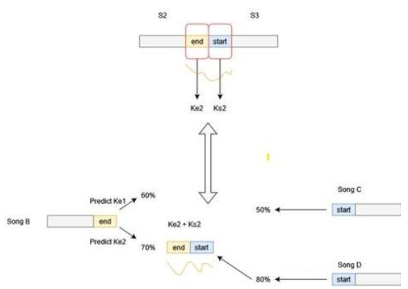
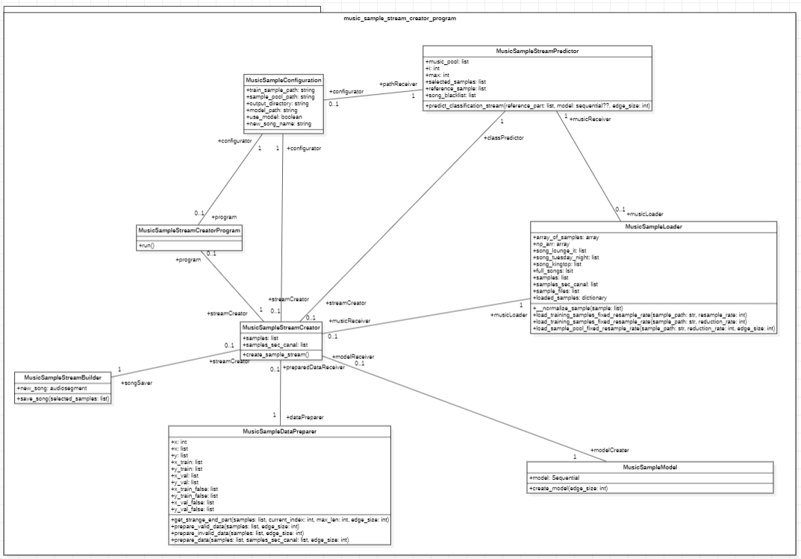

# Inhaltsverzeichnis:

[**Forschungsfragen**](#inhaltsverzeichnis) 

[**Theoretische Grundlagen**](#theoretische-grundlagen) 

[1.1. Convolutional Neural Networks (CNN)](#11-convolutional-neural-networks-cnn) 

[1.2. LSTM](#12-lstm) 

[1.3. Layers](#13-layers) 

[1.4. Aktivierungsfunktionen](#14-aktivierungsfunktionen) 

[1.5. Klassifizierung](#15-klassifizierung) 

[1.5.1. Cross Entropy](#151-cross-entropy) 

[1.5.2. Binary Cross Entropy loss](#152-binary-cross-entropy-loss) 

[1.5.3. Categorical Cross Entropy loss](#153-categorical-cross-entropy-loss) 

[1.6 Optimizer](#16-optimizer) 

[**Umsetzung der Challenge 3**](#umsetzung-der-challenge-3) 

[2.1. Trainings- und Testdaten](#21-trainings--und-testdaten) 

[2.2. LSTM & CNN Binary Cross Entropy Ansatz (Präsentierter Ansatz)](#22-lstm--cnn-binary-crossentropy-ansatz-präsentierter-ansatz) 

[2.3. Forecasting mit CNN-LSTM](#23-forecasting-mit-cnn--lstm) 

[2.4. Categorical CNN-LSTM](#24-categorical-cnn--lstm) 

[2.5. Klassifizierung von Start- und Endstücken (Cross Entropy for classification)](#25-klassifizierung-von-start--und-endstücken-cross-entropy-for-classification) 

[2.5. Klassendiagramm Ansatz LSTM & CNN Binary Cross Entropy)](#25-klassifizierung-von-start--und-endstücken-cross-entropy-for-classification) 

# 

# Forschungsfragen

**Lässt sich ein „hörbarer“ Musikstream erzeugen?**

Ja es lässt sich ein hörbarer Song erzeugen. Die Qualität des Songs variiert allerdings sehr stark und oftmals sind unterschiede in aufeinanderfolgenden Samples zu erkennen.

**Reicht das stochastische Sampling? Wie lange ist eine optimale Sampledauer?**

Das Stochastische Sampling basierend auf der cut_on_silence Methode erzielte die besten Ergebnisse. Die Sample (Chunkdauer) konnte hierbei nicht einheitlich gewählt werden, weshalb eine Edge-Size basierend auf dem kleinsten Sample definiert wurde und diese auf alle größeren Chunks angewandt wurde. Dies ist notwendig um gleich lange Chunks in den Input Layer übergeben zu können.

Ergebnis von cut-on-silence Methode mit 16dB:

*Abbildung 1 - Modellergebnis Chunk mit Silence Cut Methode bei 16 db (Eigene Darstellung)*

Ein weiterer test beruhte auf gleich Lang geschnittenen Chunks.

Das beste Ergebnis bei den gleich lang geschnittenen Chunks lieferte die Chunklänge von 5 Sekunden.

Ergebnis von 5 Sekunden

*Abbildung 2 - Modellergebnis Chunklänge von 5 Sekunden (Eigene Darstellung)*

Ergebnis von 3 Sekunden

*Abbildung 3 - Modellergebnis Chunklänge von 3 Sekunden (Eigene Darstellung)*

Ergebnis von 1 Sekunde

*Abbildung 4 - Modellergebnis Chunklänge von 1 Sekunde (Eigene Darstellung)*

**Wie ähnlich müssen sich die Urspungstracks bezüglich Stimmung, Genre, etc sein?**

Es wurden sowohl mit unterschiedliche Genre und Stimmungen verwendet gearbeitet als auch mit Trainings Songs, welche sich von der Stimmung und dem Genre ähneln. Die Songs, welche sich ähneln lieferten hierbei ein besseres Ergebnis bei der Prediction. Ein hoher Wert nahe 1 steht hierbei für die Klasse True und ein niedriger welcher gegen 0 geht für die Klasse False.

*Abbildung 5 - Modellergebnis von Songs aus ähnlichen Genres (Eigene Darstellung)*

Die Songs, welche aus unterschiedlichen Genres stammen lieferten eine schlechtere Vorhersage der Werte bei gleichbleibenden Werten im Modell und den Epochen.

*Abbildung 6 - Modellergebnis von Songs aus unterschiedlichen Genres (Eigene Darstellung)*

Somit lässt sich die Forschungsfrage damit beantworten, dass ähnliche oder gleiche Genres das Training erleichtern um ein besseres Ergebnis zu liefern. Abweichungen der Songs im selben Genre hatten jedoch nur wenig Gewichtung.

**Müssen Metadaten wie Lautstärke, Tempo, Spektrum, etc. mit einbezogen werden?**

Beim Schneiden wurde die Lautstärke eines Songs mit einbezogen. Lieder wurden an Stellen in Chunks geschnitten, an denen eine bestimmte Dezibelzahl für eine gewisse Zeit unterschritten wurde.

# Theoretische Grundlagen

## 1.1. Convolutional Neural Networks (CNN)

Unter einem Convolutional neural Network (CNN) versteht man ein spezielles Feed-Forward-Netz. Mithilfe eines CNNs können große Mengen an Eingabedaten, die beispielsweise bei der Bilderkennung anfallen, verarbeitet werden. Hierbei werden Daten verwendet, welche in einer Gitterstruktur abgebildet werden. Gitterstrukturen findet man in Bildern sowie Zeitreihen. Unter einer Faltung (engl. Convolution) versteht man eine lineare Operation, welche anstatt der sonst üblichen Matrix-Vektor-Multiplikation für CNNs verwendet wird. Sobald diese mathematische Operation in mindestens einem Layer vorhanden ist, liegt ein Convolutional neural Network vor. Die typische Architektur eines CNNs besteht aus einem Stack von Convolutional- und Pooling-Schichten, gefolgt von Dense Layern. Netzwerk erkennt Bildverzerrungen und andere optische Veränderungen und berücksichtigt diese bei der Verarbeitung. Durch die Pooling-Schichten werden Informationen zu den gescannten Features verdichtet. Das Flattening (Glätten) wandelt die Daten wieder in einen Vektor um. Somit werden jeweils die stärksten Features herausgefiltert und die schwachen verworfen (Frochte, 2020).

### Convolution (Faltung)

Im Zentrum einer Convolution steht der Kernel. Dieser wird auf den Input angewendet. Der Kernel ist ein Gewichtsgitter, welcher üblicherweise bei der Bildverarbeitung verwendet wird. Ein Kernel, sprich ein Filter, ist ein Merkmals Detektor (feature detector). Beim Trainieren eines CNN werden die Werte eines Kernels vom Netzwerk trainiert, um Merkmale zu erkennen und zu extrahieren. In Abbildung 7 wird ein 3 x 3 Kernel mit den Gewichten (W) dargestellt (Raghav P.,2020).

*Abbildung 7 - 3 x 3 Kernel (Eigene Darstellung)*

Um diesen Kernel anwenden zu können, muss vorab ein Bild in ein Gitter von Pixeln umgewandelt werden. Jeder Wert in diesem Gitter stellt somit einen Pixel dar (Raghav P.,2020).

*Abbildung 8 - Bild in Pixelformat (Eigene Darstellung)*

Das Resultat aus dieser Convolution ist ein Output (Abbildung 9). Dieser Output hat dieselbe Höhe, sowie Weite des Bildes (Abbildung 8). Der Output entsteht indem der Kernel über das Bild gelegt wird. Das Zentrum des Kernels, die Nummer 1, liegt somit über der Nummer 4 des Bildes. Das daraus resultierende Ergebnis wird im gleichen Index des Originals angegeben.

Das Ergebnis wird anhand des Skalarprodukts folgendermaßen berechnet:

= 5\*1+2\*0+3\*0+…+0\*-1= 18

Das Ergebnis 18 ist nun der Output aus Kernel und Image. Daraufhin wird der Kernel bei einer Stride von 1 eine Spalte nach rechts verschoben. Das Ergebnis des Skalarprodukts des nach rechts verschobenen Kernels ergibt 10. Dies wird so lange weitergeführt, bis alle Outputergebnisse ausgefüllt sind.

Damit das Zentrum des Kernels auch auf die Pixel passt, die am Rande des Images stehen, wie die Zahl 5 im linken oberen Rand, wird das Null Padding angewandt. Hierbei werden Zeilen und Spalten mit Nullen auf jeder Seite der Eingabe-Merkmalskarten hinzugefügt. In diesem Fall hat die Ausgabe die gleiche Dimension wie die Eingabe (Raghav P.,2020).

*Abbildung 9 - Output aus Bild (Image) und Kernel (Eigene Darstellung)*

### Spezifikationen CNN

#### Grid size (Gittergröße/Rastergröße)

Die Gittergröße stellt die Anzahl der Pixel für Höhe und Breite dar. In der Abbildung 7 wird ein 3 by 3 Kernel dargestellt, da hier 3 Werte für die Breite und 3 Werte für die Höhe angezeigt werden. Bei der Zahlenangabe der Gittergröße eines Kernels müssen ungerade Zahlen verwendet werden (Raghav P.,2020).

#### Stride

Unter der Stride versteht man einen Parameter des Filters (Kernels) des neuronalen Netzes, der das Ausmaß der Bewegung über das Bild oder Video modifiziert. Beispiel: Bei einem Stride von 1 würde sich der über das Bild gelegte Kernel immer um 1 Pixel verschieben. Somit würde der Kernel nicht in der Spalte 5,2,5 (rot markiert) beginnen, sondern bei 2,4,1 (Abbildung 9) (Raghav P.,2020).

##### Depth (Tiefe)

Bei einem RGB (adaptiver Farbraum von Grün, Blau, Rot) Bild benutzt man ein drei dimensionales Array als Kernel. Die erste Dimension ist die Höhe, die zweite Dimension die Breite und die dritte Dimension stellt die Tiefe, sprich den Channel des Bildes dar.

#### Anzahl der Kernel

Die Anzahl der Kernel bezieht sich auf die Convolutional Schicht. Diese Schicht besteht meist aus mehreren Kernels, wobei jeder einzelne Kernel einen zweidimensionalen Array ausgibt. Somit hat eine Convolutional Schicht so viele Outputs (zweidimensionale Arrays) wie Anzahl von Kernel (Raghav P.,2020).

#### Pooling

Mit Pooling werden Merkmale in Teilbereiche der feature Map (Merkmalskarte) zusammengefasst (down sampling). Zwei gängige Pooling-Methoden sind das Average Pooling und das Max Pooling, die das durchschnittliche Auftreten eines Merkmals bzw. das am stärksten aktivierte Vorkommen eines Merkmals zusammenfassen. Pooling in CNN ist somit eine Technik zur Verallgemeinerung von Merkmalen, die durch Faltungsfilter extrahiert werden, und hilft dem Netz, Merkmale unabhängig von ihrer Position im Bild zu erkennen.

Das grundlegende Verfahren des Poolings ist dem Convolutional sehr ähnlich. Der Poolingfilter schiebt sich über die Ausgabe-Merkmalskarte (Output feature Map) der vorangegangenen Faltungsschicht. Die am häufigsten verwendete Filtergröße ist 2×2 und wird mit einer Schrittweite von 2 über die Eingabe geschoben. Auf der Grundlage der gewählten Pooling-Operation berechnet der Pooling-Filter eine Ausgabe auf dem rezeptiven Feld (Teil der Merkmalskarte unter dem Filter) (Raghav P.,2020).

### Convolutional Neural Network Architektur

In Abbildung 10 wird eine typische CNN Architektur dargestellt.

Hierbei ist die Ausgangslage, Bilder von Transportmitteln anhand eines neuronalen Netzwerkes zu klassifizieren und zuzuordnen.

Zuerst wird der Input hier ein Bild eines einfachen Autos in die Feature Learning Phase gegeben.

Die Convolutional Schicht, als erster Layer extrahiert die Merkmale des Bilds. Danach wird die Ausgabe einer Aktivierungsfunktion unterzogen, um Nichtlinearität zu ermöglichen. Die übliche Aktivierungsfunktion ist die RelU. Alle Pixel mit einem negativen Wert werden durch null ersetzt. Anhand des darauffolgenden Pooling Layers wird Dimensionalität des Eingangsbilds reduziert. Dies hilft dem Netzwerk, die Rechenkomplexität des Vorgangs zu verringern. Durch die Verringerung der Dimensionalität hat das Netzwerk weniger Gewichte zu berechnen, was ein Overfitting verhindert. In der Feature Learning Phase werden weitere Convolution + RelU und Pooling Layer eingesetzt, um die Merkmale weiter zu spezifizieren. Somit werden anfangs low level-Merkmale extrahiert wie z.B. Kanten. Mit der nächsten Aneinanderkettung von Schichten werden bereits Formen erkannt. Umso mehr Schichten eingebaut werden, desto mehr Merkmale können extrahiert werden.

In der Klassifikation werden die Resultate in Matrixform durch einen Flatten-Layer in Vektoren umgewandelt. In der Fully Connected Schicht werden die Merkmale in Vektor Form kombiniert, um das KI Modell zu erstellen. Schließlich wird anhand einer Aktivierungsfunktion wie SoftMax oder Sigmoid die Ausgabe (Output) klassifiziert und den verschiedenen Kategorien wie Car, Truck, Van, Bicycle hinzugefügt (Raghav P.,2020).

*Abbildung 10 - Convolutional Neural Network Architektur (Raghav P. 2020)*

## 1.2. LSTM

Das LSTM ist eine bestimmte Art eines rekurrenten neuronalen Netzes. Eines der Hauptprobleme eines RNN’s ist, dass dieses nur die Informationen über den vorherigen Zustand speichert, was einen verschwindenden Gradienten verursacht. Das Long short-term-memory (LSTM) behandelt dieses Problem des verschwindenden Gradienten.

*Abbildung 11 - RNN versus LSTM (Vishwas & Patel, 2020, S. 211)*

Das LSTM hat im Gegensatz zu einem herkömmlichen RNN folgende zusätzliche Eigenschaft, die als Memory (dt. Gedächtnis) bezeichnet wird:

-   Forget gate (ein neuronales Netz mit Sigmoid Aktivierung σ)
-   Candidate Layer (ein neuronales Netz mit tanH-Aktivierung)
-   Input gate (ein neuronales Netz mit Sigmoid Aktivierung)
-   Output gate (ein neuronales Netz mit Sigmoid Aktivierung)
-   Hidden state
-   Memory Cell (Zellstatus)

### Schritt für Schritt Erläuterung einer LSTM Zelle:

Ht-1 ist der Hidden State Vektor der LSTM- Zelle zum vorherigen Zeitpunkt t-1. Ht ist der generierte Hidden State der aktuellen Zelle (LSTM-Zelle zum aktuellen Zeitpunkt).

Ct-1 repräsentiert den Zellstatus der vorherigen Zelle (Zelltstatus zum Zeitpunkz t-1). C ist für das Langzeitgedächtnis, sprich dem Speichern von langfristigen Abhängigkeiten und Mustern, verantwortlich..

#### Step 1 (Forget gate):

Im ersten Schritt wird das forget gate betrachtet. Hierbei (siehe Abbildung 12 – Step 1. Forget Gate: Formel) steht ft für die Forget Matrix für t. Diese Matrix stellt die Lösung für das forget gate dar. Zuerst wird der Input xt im aktuellen Zeitschritt mit h t-1 verkettet []. Auf diese Verkettung wird die Sigmoid Funktion angewandt. Daraufhin wird bf (Bias) addiert. Zuletzt wird Wf angewendet, welches die Weight Matrix dieses Dense Layers darstellt. Sobald diese Formel ausgeführt wurde, wird eine Forget Matrix erzeugt, welche als Filter fungiert, um bestimmte Informationen zu vergessen. Die Sigmoid Funktion wird verwendet, da sie einen großen Eingaberaum in einen kleinen Eingaberaum zwischen 0 und 1 presst. Dies ist vorteilhaft als Filter, da die Werte in dieses Intervall gedrängt werden. Die Indizes die näher am Wert 0 stehen, sind die relativen Indizes welche im Zellstatus vergessen (forget) werden. Indizes welche einen Wert nahe 1 haben werden behalten. Somit werden Werte die in einer Matrix mit 0 multipliziert werden verworfen.

Im Schritt 1.2 wird der alte Zellstatus Ct-1 mit dem neu generierten ft multipliziert. Formel: Cft = Ct-1 \* ft .

Beispiel:

Ct-1 = [1,2,4]

Ft = [1,0,1]

Cft = [1,2,4] \*[1,0,1] = [1,0,4]

Der erste Index und der dritte Index werden behalten und der mittlere Index da = 0 wird verworfen.

#### Step 2 (Input and Candidate gate):

Im zweiten Schritt wird das Input-, sowie das Candidate gate miteinander multipliziert. Das Ergebnis dieser Multiplikation wird dann mit der Information (Ergebnis) aus Schritt 1.2 addiert.

Zuerst wird das Input Gate it erstellt (siehe Abbildung 12 –Step 2. Input and Candidate Gate – 1. Formel). Die Lösung des Input Gates wird als Matrix dargestellt und dient als Filter für die simple RNN Komponente (tanH). Hierbei hat die erzeugte Matrix it dieselbe Dimensionalität wie das Ergebnis der tanH Schicht, damit diese kompatibel sind. Um diese Dimensionalität zu erzeugen wird wieder eine Sigmoid Funktion auf die Verkettung von [h t-1 , xt ] wie im ersten Schritt angewendet und mit Wi multipliziert und Bias addiert.

Das Candidate Gate Ć (siehe Abbildung 12 –Step 2. input and candidate gate – 2. Formel) dient als neuer Zellstatus, welche die Funktion des vorherigen Zeitschritts beinhaltet. Jedoch wird dieses Mal nicht mit einer Sigmoid Funktion multipliziert, sondern mit einer tanH Aktivierungsfunktion.

Die beiden Ergebnisse des Candidate Gate und des Input Gates werden anschließend multipliziert. Hierbei entscheidet das it welche Informationen wichtig sind und filtert diese aus. Somit ist C der Zellstatus zu einer bestimmten Zeit t mit gefilterten Inputs.

Cit = Ćt \*it

#### Schritt 3 (Zellstatus):

Der Zellstatus Ct des aktuellen Zeitschritts setzt sich somit aus Ct= Cft + Cit zusammen. Cft zeigt an welche Informationen aus dem vorherigen Zellstatus vergessen werden sollen und Cit fügt den neuen aktuellen Input hinzu.

#### Schritt 4 (Output Gate):

Im Output Filter Ot wird die Output Matrix generiert. Auch bei dieser wird wieder die Sigmoid Funktion angewendet, die bereits in Step 1 und Step 2 vorkam (siehe Abbildung 12 –Step 2. input and candidate gate – 1. Formel). H t ist der Hidden State für den jetzigen Zeitschritt, sowie dem Output. Um h t zu generieren wird ot mit dem Zellstatus, durchlaufen von tanH, tanH(Ct) multipliziert. TanH fungiert hier nicht als Layer, sondern ist nur die Funktion an sich. TanH wird verwendet, da auch diese Funktion die Werte zwischen - 1 und 1 prestt. H t wird als Hidden State für den jetzigen Zeitschritt verwendet und als Dense Layer für die Vorhersage verwendet.

*Abbildung 12 - LSTM Zelle (Vishwas & Patel, 2020. S.212*

## 1.3. Layers

Im Folgenden werden unterschiedliche Schichten in einem Neuronalen Netz erläutert und kurz vorgestellt.

#### Convolutional Layer

Diese erste Schicht analysiert die eingegebenen Informationen und erkennt das Vorhandensein einer Reihe von Merkmalen. Der Convolutional Layer erzeugt eine Faltung über eine einzige räumliche oder zeitliche Dimension. Der Input Shape beschränkt sich auf die Anzahl der Elemente innerhalb einer Dimension (siehe Convolutional Neural Networks).

#### LSTM-Layer

Eine LSTM-Schicht lernt Langzeit Abhängigkeiten zwischen Zeitschritten in Zeitreihen und Sequenzdaten. Die Schicht führt additive Interaktionen durch, die dazu beitragen können, den Gradientenfluss über lange Sequenzen während des Trainings zu verbessern (siehe LSTM).

#### Dropout Layer

Ein Fully Connected Layer beansprucht die meisten Parameter, so dass die Neuronen während des Trainings eine gegenseitige Abhängigkeit entwickeln, was die individuelle Leistung der einzelnen Neuronen einschränkt und zu einer Überanpassung der Trainingsdaten führt.   
Dropout-Layer sind eine Regulasierungstechnik, die darin besteht, bei jeder Aktualisierung während des Trainings einen Teil der Input Unit auf 0 zu setzen. Dadurch wird Overfitting verringert und Generalisierungsfehler in neuronalen Netzen verbessert. Dieser Anteil der Input Units, die auf 0 gesetzt werden sollen, wird durch einen Parameter bestimmt.

*Abbildung 13 - Droput Layer (Srivastava, Nitish, et al. “Droput: a simple way to prevent neural networks from overfitting”)*

#### Max Pooling Layer

Das Max Pooling ist ein Beispiel-basierter Diskretisierungsprozess. Hierbei wird die Eingabe abgetastet, um die Dimensionalität zu reduzieren. Somit werden die zu erlernenden Parameter, sowie der Rechenaufwand reduziert (siehe Pooling in Convolutional Neural Network).

#### Dense Layer / Fully Connected Layer

Das Dense Layer, auch Fully Connected Layer genannt, ist eine Schicht, die in der letzten Phase des Neuronales Netzwerks verwendet wird. Diese Schicht ermöglicht es, die Dimensionalität der Ausgabe der vorangegangenen Schicht zu ändern, so dass das Modell die Beziehung zwischen den Werten der Daten, mit denen es arbeitet, leicht definieren kann. Die Neuronen des Dense Layers in einem Modell erhalten die Ausgaben aller Neuronen der vorhergehenden Schicht, wobei die Neuronen des Dense Layers eine Matrix-Vektor-Multiplikation durchführen. Die Matrix-Vektor-Multiplikation ist ein Verfahren, bei dem der Zeilenvektor der Ausgabe der vorangegangenen Schichten gleich dem Spaltenvektor der Dense Schicht ist. Die allgemeine Regel der Matrix-Vektor-Multiplikation lautet, dass der Zeilenvektor genauso viele Spalten haben muss wie der Spaltenvektor (Skúli, 2018).

## 1.4. Aktivierungsfunktionen

Die Aktivierungsfunktion ist eine mathematische Formel / Funktion, welche den Output des Models angibt. Das Ergebnis dieser Funktion liegt meist zwischen 0 bis 1 oder –1 bis 1. Die Funktion wird verwendet, damit den Neuronen nichtlineare Funktionen hinzugefügt werden können. Somit kann sich das neuronale Netz jeder nichtlinearen Funktion nähern und auf nichtlineare Modelle angewendet werden. Wenn die Aktivierungsfunktion nicht benutzt wird, ist die Ausgabe einer jeden Schicht eine lineare Funktion der Eingabe der oberen Schicht. Neuronale Netze müssen in der Lage sein, nicht lineare Beziehungen zwischen Eingabevektoren x und Ausgaben y zu approximieren. Je komplexer die Daten, aus welchen das Netz etwas zu lernen versucht, umso nicht linearer ist die Abbildung von x auf y (Vishwas & Patel, 2020).

Es gibt folgende Arten von nichtlinearen Aktivierungsfunktionen:

-   Sigmoid
-   TanH
-   RelU
-   Leaky RelU
-   Parametic RelU
-   Softmax
-   Swish

Im Folgenden werden auf einzelne dieser nicht linearen Aktivierungsfunktionen eingegangen:

#### Sigmoid

Die Sigmoid Funktion ist an den Bereich der Ausgabewerte [0,1] gebunden. Somit normalisiert diese Funktion die Ausgangswerte jeder Schicht. Sie hat einen gleichmäßigen Gradienten und kann nicht mit dem Problem des verschwindenden Gradienten umgehen, wenn die Eingabewerte hoch oder niedrig sind. Dies liegt daran, dass diese einen großen Eingaberaum in einen kleinen Eingaberaum zwischen 0 und 1 presst. Deswegen bewirkt eine große Änderung der Eingabe der Sigmoid Funktion eine kleine Änderung der Ausgabe. Folglich wird die Ableitung kleiner. Je mehr Schichten mit bestimmten Aktivierungsfunktionen zu neuronalen Netzen hinzugefügt werden, desto mehr nähert sich der Gradient der Verlustfunktion dem Wert Null, wodurch das Netz schwer zu trainieren ist. Somit sollte für den vanishing gradient eine andere Funktion verwendet werden (Vishwas & Patel, 2020).

*Abbildung 15 - Sigmoid Aktivierungsfunktion (Vishwas & Patel,2020, S.191)*

#### TanH (Tangens-Hyperbolicus Funktion)

Die TanH Funktion ist an den Bereich der Ausgabewerte [-1,1] gebunden. Bei diesem Modell können stark negative, neutrale und stark positive Werte verarbeiten werden. Diese ähnelt der Sigmoid Aktivierungsfunktion mit Ausnahme des Bereichs. Zudem sind die Ausgabewerte null-zentriert (Oppermann, 2022).

*Abbildung 16 - TanH Aktivierungsfunktion (Vishwas & Patel,2020, S.192)*

#### RelU (Rectified Linear Unit)

Die RelU Funktion (dt. Gleichgerichtete Lineareinheit) ist eine Funktion, welche in der Lage ist Berechnungen durchzuführen, die einer linearen Aktivierungsfunktion ähneln, jedoch Backpropagation ermöglicht.  
Sobald der Eingabewert unter 0 liegt oder negativ ist die Funktion nicht in der Lage Backpropagation durchzuführen und hört auf zu lernen. Auch bekannt als sterbendes RelU Problem. Unter der Backpropagation versteht man den Prozess der Fehlerweitergabe, welcher von der verborgenen Schicht zurück zur Eingabeschicht geht, um die Gewichte zu regulieren (Vishwas & Patel, 2020).

Im Gegensatz zu den vorherigen genannten Funktionen hat RelU keine rechenaufwändigen Operationen wie beispielsweise Exponenten. RelU kann durch die Bildung eines Schwellenwerts eines Wertevektors bei Null implementiert werden (Oppermann, 2022).

*Abbildung 17 - RelU Aktivierungsfunktion (Vishwas & Patel,2020, S.192)*

#### Leaky RelU

Der Vorteil dieser Funktion liegt darin, dass es das sterbende RelU Problem löst. Hierbei wird durch eine Funktion, die horizontale Linie Werte unter Null durch eine nicht-horizontale, lineare Linie ersetzt. Somit werden null-Gradienten vermieden Vishwas & Patel, 2020).

*Abbildung 18 - Leaky RelU Aktivierungsfunktion (Vishwas & Patel,2020, S.193)*

#### SoftMax

Die SoftMax Aktivierungsfunktion wird nur in der letzten Schicht angewandt und auch nur um dem neuronalen Netz bei Klassifizierungsaufgaben, Wahrscheinlichkeitswerte vorhersagen zu lassen. Sprich die SoftMax-Aktivierungsfunktion zwingt die Werte der Ausgangsneuronen dazu, Werte zwischen 0 und 1 anzunehmen, damit die Wahrscheinlichkeitswerte im Intervall [0,1] dargestellt werden. Außerdem werden bei der Klassifizierung von Eingabemerkmalen in verschiedenen Klassen, diese Klassen gegenseitig ausgeschlossen. Jeder Merkmalsvektor x gehört nur einer Klasse an (Oppermann, 2022).

*Abbildung 19 – SoftMax Aktivierungsfunktion (Vishwas & Patel, 2020, S. 194)*

### Schlussfolgerungen zu den Aktivierungsfunktionen:

-   ReLU sollte in den Hidden Layers verwendet werden.
-   Bei Klassifizierungsaufgaben sollte in der Ausgabeschicht die SoftMax Aktivierung verwendet werden.
-   Wenn das Netz Werte vorhersagen soll, die größer als 1 sind, ist die RelU Funktion zu verwenden.
-   Soll das Netz Werte zwischen [0,1] oder [-1,1] im Ausgabewert anzeigen, sollte Sigmoid oder TanH genutzt werden.

## 1.5. Klassifizierung

Klassifizierungsverfahren teilen Objekte nach ihren Merkmalen mit Hilfe eines Klassifikators in vordefinierte Kategorien ein. Im Machine Learning gibt es diverse Klassifikationsverfahren. Zum einem die Multi Class Klassifikation und zum anderen die Multi Label Klassifikation. Bei der Multi Class Klassifikation schließen sich die Klassen gegenseitig aus. Beispielsweise wird davon ausgegangen, dass jeder Chunk nur einem einzigen Merkmal zugeordnet werden kann: Ein Gemüse kann entweder eine Tomate oder eine Gurke sein, aber nicht beides gleichzeitig. Bei der Multi Label Klassifikation kann ein Chunk mehrere Merkmale aus der Anzahl der verfügbaren Klassen erhalten. Beispielsweise kann ein Film dem Genre Komödie, Abenteuer sowie Science-Fiction angehören. Bei der binären Klassifikation nimmt ein Chunk nur ein Merkmal aus zwei Klassen an (bspw. True or false, 0/1) (Goyal, 2021).

#### 3 Arten von Klassifizierungen

1.  Binäre Klassifizierung: zwei exklusive Klassen
2.  Multi Class Klassifikation: mehr als zwei exklusive Klassen
3.  Multi-Label-Klassifikation: nur nicht-exklusive Klassen

#### Zugehörige Cross Entropy Ansätze

-   Im Fall 1 wird das binary cross entropy verwendet
-   Im Fall 2 wird die categorical cross entropy verwendet.
-   Im Fall 3 wird das binary cross entropy verwendet

In der folgenden Abbildung 20 werden zu diversen Klassifizierungen die Loss function sowie weitere zugehörige Spezifikationen abgebildet.

*Abbildung 20 - Loss Function Zuordnung*

### 1.5.1. Cross Entropy

Cross Entropy (Kreuzentropie) bezeichnet ein Maß für die Qualität eines Modells für eine Wahrscheinlichkeitsverteilung. Hierbei werden loss /cost functions (Verlust-/Kostenfunktion) verwendet, um ein Modell während des Trainings zu optimieren. Ziel ist es die Verlustfunktion im Modell zu minimieren. Der Cross Entropy loss (Kreuzentropieverlust) wird zur Optimierung von Klassifizierungsmodellen eingesetzt. Mithilfe der SoftMax oder Sigmoid Aktivierungsfunktion kann der Output in Wahrscheinlichkeiten umgewandelt werden. Diese Ausgabewahrscheinlichkeiten verwendet Cross Entropy, um einen Abstand zu den Wahrheitswerten zu messen. Je näher die Modelausgabe an den gewünschten Werten liegt, desto besser. Um den Cross Entropy loss zu minimieren können während des Modelltrainings die Modelgewichte iterativ angepasst werden. Ein perfektes Model hat einen cross entropy loss von 0 (Koech, 2021).

### 1.5.2. Binary Cross Entropy loss

Die binary cross entropy (binäre Kreuzentropie) wird häufig als durchschnittliche Kreuzentropie für alle Datenbeispiele genannt. Bei der binären Klassifikation werden zwei exklusive Klassen verwendet (in verwendeten Fall true (1) and false (0)), welchen Informationen zugeordnet werden. Die Ausgabeschicht muss mit einem einzigen Knoten und einer "sigmoiden" Aktivierung konfiguriert werden, um die Wahrscheinlichkeit für Klasse 1 vorherzusagen. Daher kann man für die binäre Klassifikation die binäre Kreuzentropie verwenden. Beim binary cross entropy kann Multi Label Klassifikation oder die Binäre Klassifikation verwendet werden. (Koech, 2021).

*Abbildung 21 - Binary Cross Entropy (Brownlee, 2020)*

### 1.5.3. Categorical Cross Entropy loss

Die Categorical Cross Entropy wird verwendet, wenn Merkmale mit true durch1-aus-n (One- Hot-Kodierung) gekennzeichnet wurden. Beispielsweise bei folgenden true Werten in einem drei Klassen Klassifizierungsproblem [1,0,0],[0,1,0] und [0,0,1]. Die Ausgabeschicht ist mit n Knoten (einem für jede Klasse) konfiguriert und einer "Softmax"-Aktivierung, um die Wahrscheinlichkeit für jede Klasse vorherzusagen. Hierbei wird die Multi Class Klassifikation angewandt, da es mehr als zwei Klassen gibt (Koech, 2021).

*Abbildung 22 - Categorical Cross Entropy (Brownlee, 2020)*

## 

## 1.6 Optimizer

Optimzer (Optimierer) sind Algorithmen oder Methoden, die zur Minimierung einer Fehlerfunktion (Verlustfunktion) oder zur Maximierung der Effizienz der Produktion eingesetzt werden. Optimierer sind mathematische Funktionen, die von den erlernbaren Parametern des Modells abhängen, das heißt von den Gewichten und Verzerrungen. Optimierer ermöglichen es, die Gewichte und die Lernrate des neuronalen Netzes zu ändern, um die Verluste zu reduzieren(Mustafa, 2022).

#### RMSprop (Root Mean Square Propagation)

RMS-Prop ist eine spezielle Version von Adagrad, bei der die Lernrate ein exponentieller Durchschnitt der Gradienten ist und nicht die kumulative Summe der quadrierten Gradienten.

Vorteile: Bei RMS-Prop wird die Lernrate automatisch angepasst, und es wird für jeden Parameter eine andere Lernrate gewählt.

Nachteile: Langsames Lernen.

#### SGD (Stochastic Gradient Descent)

SGD ist eine Variante des Gradientenabstiegs. Es aktualisiert die Modellparameter nacheinander. Wenn das Modell 10K Datensätze hat, aktualisiert SGD die Modellparameter 10k Mal( Mustafa, 2022).

Vorteile: Häufige Aktualisierungen der Modellparameter, benötigt weniger Speicherplatz, ermöglicht die Verwendung großer Datensätze, da jeweils nur ein Beispiel aktualisiert werden muss(Mustafa, 2022).

Nachteile: Die häufigen Aktualisierungen können auch zu verrauschten Gradienten führen, die den Fehler vergrößern, anstatt ihn zu verringern. Häufige Aktualisierungen sind außerdem rechenaufwendig.

#### Adam (Adaptive Moment Estimation)

Der Adam-Optimizer ist einer der beliebtesten und bekanntesten Gradientenabstiegs-Optimierungsalgorithmen. Es handelt sich um eine Methode, die adaptive Lernraten für jeden Parameter berechnet. Er speichert sowohl den abklingenden Durchschnitt der vergangenen Gradienten, als auch den abklingenden Durchschnitt der vergangenen quadrierten Gradienten, ähnlich wie RMS-Prop (Mustafa, 2022).

Vorteile: Einfach zu implementieren, rechnerisch effizient, geringer Speicherbedarf.

# Umsetzung der Challenge 3

## 2.1. Trainings- und Testdaten

Für die Trainings und Testdaten wurde ein Musikpool von 3 Songs des Genres House/Lounge im MP3 Format erstellt. Es wurde darauf geachtet, dass die Songs keinen Gesang enthalten. Denn es wurde die Grundannahme getroffen, dass willkürlich geschnittene Chunks von Songs mit Gesang schwieriger zusammenzuführen sind als instrumentale Songs. Demnach wurde auf Gesang in den Songs verzichtet, um eine hörbare Qualität beim vom künstlichen neuronalen Netz vorhergesagten Song zu erhalten.

Für das Schneiden der Songs wurden zwei Varianten, das stochastische Scheiden und das Schneiden in gleich lange Chunks, festgelegt, welche im Folgenden näher erläutert werden.

#### Stochastisch (Silence)

Bei der stochastischen Schnittweise, wurden die Musikdateien an einer Stelle mit vordefinierter Dezibel Zahl geschnitten. Hier wurde ein Schwellwert von -16dB gewählt, welches einer etwas ruhigeren Stelle entspricht. Zudem wird die (silence_duration) in Millisekunden definiert. Diese wurde auf 300 Millisekunden festgelegt. Somit soll der Song an Stellen, die den Schwellwert -16dB unterschreiten und diesen für eine bestimmte Millisekunde halten, geschnitten werden. Es wurde mit verschiedenen Schwellwerten getestet, -16dB hat sich hierbei als beste Variante vom hörbaren Erlebnis herausgestellt.

#### Gleiche Chunk-Länge

Bei der zweiten Schnittweise wurden die Musikdateien in gleich große Chunks geschnitten und im MP3 Format abgespeichert. Die Berechnung wird anhand der Länge des Songs in Millisekunden umgerechnet und basierend auf dem Eingabeparameter des Users geschnitten. Gibt der User beispielsweise 3 Sekunden in das Terminal ein, schneidet das Programm den Song alle 3000 Millisekunden. Somit entstehen gleich lange Chunks eines Songs.

#### MP3 vs Wav

Aufgrund des Forschungsansatzes wurden die Songs zuerst im WAV-Audioformat heruntergeladen. Hierbei war der Gedanke, dass durch WAV-Dateien mehr Informationen an das Modell übergeben werden können. Durch das Testen im Modell wurde jedoch schnell klar, dass das künstliche neuronale Netz durch die hohe Anzahl an Datenpunkten einen enormen Zeitaufwand zum Trainieren benötigt.

Aufgrund der langen Trainingsdauer wurden die Songs im nächsten Schritt als MP3-Format heruntergeladen. Der Unterschied zu den WAV-Dateien besteht darin, dass MP3-Dateien Audioinhalte repräsentieren, die als Resultat einer verlustfreien Kompression entstehen. Im MP3-Format werden einzelne Frequenzbänder unterteilt. Beim Übertönen eines Frequenzbandes wird dieses nur in sehr geringer Präzision gespeichert. Das menschliche Gehör merkt diesen Unterschied jedoch nicht. Durch dieses Vorgehen ist eine Kompressionsrate von fast 90 % gegenüber WAV-Dateien zu erreichen (Martin et al., 2016).

## 2.2. LSTM & CNN Binary Crossentropy Ansatz (Präsentierter Ansatz)

### Finales Modell: Kombination von CNN und LSTM

Im finalen Ansatz werden LSTM- und CNN Layer kombiniert, um die Zusammenhänge zwischen den verschiedenen Daten der Zeitreihe besser zu verstehen und sequentielle Abhängigkeiten in einer Zeitreihe zu berücksichtigen (Zhang et al., 2020). Auf diese Weise kann die LSTM-Schicht die sequenziellen Abhängigkeiten in der Zeitreihe berücksichtigen, während die CNN-Schicht diesen Prozess durch den Einsatz von dilatierten Faltungen weiter unterstützt. Der CNN Layer sucht innerhalb der Daten anhand von Feature Maps markante Punkte. Nachdem die markanten Punkte gefunden wurden, wird durch einen Max Pooling Layer eine weitere Reduktion der Daten vorgenommen (Purwins et al., 2019). Die Ergebnisse werden danach in das LSTM Netzwerk weitergegeben. Dieser Schritt ist notwendig, um das Gedächtnis des Netzwerkes abzubilden und Patterns (Muster) in den Daten zu identifizieren. Hierbei werden Datenpunkte je Zeitschritt bewertet und die Zellzustände sowie versteckte Zustände an die nächste LSTM-Zelle weitergereicht.

Es werden stochastisch geschnittene Chunks als Trainingsdaten verwendet. Im Kapitel Trainings- und Testdaten wird der für die Chunks verwendete Silence Cut näher erläutert.

### Vorgehensweise:

Zunächst werden die Chunks von Trainingssongs in Listen geladen und in die richtige Reihenfolge sortiert. Anschließend werden die Chunks in eine Liste geladen und werden auf 2 Kanäle aufgeteilt. Ein Audiosignal ist zumeist Stereo, was bedeutet er hat einen linken und einen rechten Kanal je Lautsprecher. Diese können sich teils in den Daten unterscheiden, da unterschiedliche Musikinhalte je Kanal gespeichert werden kann. Die Daten für beide Kanäle liegen anschließend in zwei Listen vor (samples, samples_sec_canal). Da nur noch jeweils ein Kanal betrachtet wird, dient dieser Schritt der Datenreduktion. Anschließend wird eine Normalisierung der Daten zwischen -1 und 1 und ein Resampling mit einer Reduktionsgröße von 35 vorgenommen. Durch das Resampling wird die Datenmenge weiter reduziert, um das Training des Modells schneller durchführen zu können. Für die Erstellung der Trainingsdaten x_train und y_train werden die Chunks aus dem ersten Kanal verwendet (samples). Zudem werden Validierungsdaten x_val und y_val erstellt. Hierfür werden die Chunks aus dem zweiten Kanal verwendet (samples_sec_canal).

Bei den meisten binären Klassifizierungen steht eine Klasse für den normalen Zustand (True) und die andere für den abweichenden Zustand (False).

Vorgehensweisen zur Realisierung der Klassifizierung: Die Trainingsdaten x_train bestehen aus validen Daten (gute Übergänge) und invaliden Daten (schlechte Übergänge). Für die validen Daten wird aus dem Trainingssong definiert, welche Chunks aufeinander folgend mit einem y_train "True"-Wert versehen werden sollen. Da diese im Ursprungssong aufeinander folgen wird angenommen, dass der Übergang für das menschliche Gehör gut klingt.

Dabei gilt beispielsweise: Chunk 1 + 2 → True, Chunk 1 + 3 → True.

Danach wird der kürzeste Chunk gesucht, um einen einheitlichen Input für das Netzwerk generieren zu können. Die resultierende Anzahl an Datenpunkten wird als Edge-Size gespeichert. Da die Chunks unterschiedliche Länge haben wird jeweils die Länge an Datenpunkten der edge_size bei den anderen Chunks betrachtet. Diese entspricht der Länge von Datenpunkten des kürzesten Chunks. D.h. bei Chunk 1 wird die Länge an Datenpunkten der edge_size am Chunk-Ende betrachtet und bei Chunk 2 die edge_size am Anfang des Chunks. Beispielsweise wird somit das Ende von Chunk 1 mit dem Anfang des Chunks 2 oder 3 zusammengenommen und bildet einen y-True Wert.

Die invaliden Daten/Übergänge werden folgendermaßen gebildet: Bei X_train_false wird zweimal ein falscher Nachfolger an einen Chunk angeklebt und mit einem"False"-Wert versehen. Um einen Chunk mit einem falschen Übergang zu finden, wird mit Hilfe der randint-Methode ein random Integer generiert und zum Index x. Das Sample an diesem Index x wird somit der Nachfolger und definiert einen falschen Übergang (y_false). Damit nicht zufällig der richtige Nachfolger durch die random.randit Methode gewählt wird, werden diese Indizes durch eine If-Abfrage ausgeschlossen. Die Abbildung 23 stellt das soeben beschriebene Vorgehen zur Erstellung der Trainingsdaten dar.

*Abbildung 23- Trainingsdaten (Eigene Darstellung)*

Damit die Trainingsdaten als Input in das Modell gegeben werden können, wird ein Reshape der Daten vorgenommen. Dies ist notwendig damit die Daten als Input verwendet werden können. Das Modell enthält die folgenden Layer und Parameter:

### CNN/LSTM Modell:

Das Modell wird in Abbildung 24 dargestellt.

#### Conv1DLayer

Diese erste Schicht dient der Generierung der nötigen Merkmale, auf deren Basis dann eine Regression oder Klassifikation durchgeführt werden kann. Die Faltungen im Conv1DLayer verändern die ursprünglichen Signale so, dass jeder Kernel bzw. Filter unterschiedliche Eigenschaften des Signals betont. Der Input Shape beschränkt sich auf die Anzahl der Elemente innerhalb einer Dimension.

-   Filters: Die Anzahl an 1024 Filter erzeugen 1024 Feature Maps, die Zahl 1024 hat die besten Ergebnisse geliefert​
-   Kernel_size: Gibt die Größe des Fensters an​
-   Input_shape: Form des Arrays, der in das Modell gegeben wird​

#### MaxPooling1D

Durch den Conv1DLayer kann der Featurespace recht groß werden, weshalb das Pooling zum Einsatz kommt. Dabei dient es als Informationsverdichtung bzw. Verallgemeinerung und reduziert das Ergebnis der Conv1D Schicht in jede Richtung um den Faktor X. In diesem Modell wird das MaxPooling verwendet.

-   Pool_size: Mit der Poolsize von 2 reduzieren wir die Daten um die Hälfte​
-   Strides: bedeutet, dass der Filter bei der Vorhersage zukünftiger Werte jeweils um x Zeitschritt nach vorne gleitet.​ Es wurde die Zahl 2 festgelegt, so dass die Ausgabesequenz etwa halb so lang wie die Eingabesequenz ist.​

#### LSTM Layer

Die LSTM-Schicht soll langfristige Abhängigkeiten zwischen Zeitschritten in den Sequenzdaten lernen. Dies basiert darauf, dass für jeden Zeitschritt innerhalb der Sequenz die Werte des vorangehenden Zeitschrittes miteinbezogen werden.

-   Units: Anzahl der Neuronen 266​
-   Return_Sequences: True

#### Dense Layer

Der Dense Layer verbindet alle Neuronen der Vorgängerschicht mit allen Neuronen der nachfolgenden Schicht​.

#### DropoutLayer

Der Dropout Layer reduziert die Anzahl der Neuronen bis zur nachfolgenden Schicht, so dass einem Overfitting des Modells entgegen gewirkt werden kann. Mit 25 % Datenreduktion wurde das beste Ergebnis erzielt​ (25 % der Daten werden auf 0 gesetzt.)

#### FlattenLayer

Durch den Flatten Layer werden alle verbleibenden Einträge in einen Vektor angeordnet und dienen dann quasi als Input in ein dichtes neuronales Netz, welches die Klassifikation durchführt.

Nachdem wir der Ansicht sind, dass wir genug Merkmale generiert haben, setzen wir das Flattening ein, so dass die Klassifikation durchgeführt werden kann.​

#### Output Layer

Der letzte Dense Layer stellt die Output Schicht dar. Alle Neuronen sind mit allen Inputs und Outputs verbunden. Enthält die 2 Klassen True und False.

Für einen Fully connected Layer haben wir nochmal zum Schluss einen Dense Layer mit der Activation Function: Sigmoid, da Werte zwischen 0 und 1 erwartet werden.

Neural Network Konfiguration:

*Abbildung 24 - Neural Network Konfiguration (Eigene Darstellung)*

#### Optimizer

Für dieses Modell wurde der Optimizer RMSprop verwendet, denn dieser liefert die besten Ergebnisse. Es wurden RMSprop, Adam und SGD (mit Learning_rate =0,01) getestet.

#### Loss-Function

Da wir unsere Chunks nach True und False bzw. 1 und 0 klassifizieren, nutzen wir die Binary Cross-Entropy Loss function​.

Training:

Für das Training werden folgende Parameter verwendet.

#### Batch_Size

Die Wahl der Batch Size ist eine wichtige Entscheidung, da sie einen starken Einfluss auf die Leistung, bspw. Die Prediction Accuracy nimmt. In den meisten Fällen ist die optimale Batch Size 64. Sie kann aber auch 32 oder 128 betragen und muss in allen Fällen durch 8 teilbar sein (Kilinc, 2021). In diesem Modell hat sich die Batch_size = 64 als beste Wahl herausgestellt.

#### Epochen

Beim Training mit 600 Epochen werden mit dem aktuellen Modell die besten Ergebnisse erzielt (siehe Abbildung 25). Dadurch konnte eine Accuracy von 95 % und ein Loss von 12 % erreicht werden.

*Abbildung 25 - Darlegung der Anzahl der Epochen (Eigene Darstellung)*

Mit dem trainierten Modell wird es nun möglich sein aus einzelnen Chunks einen kompletten Song zusammenzusetzen. Wie das funktioniert wird im Folgenden beschrieben.

Zunächst werden alle vorhandenen 1800 Chunks, welche aus 25 Songs generiert wurden, in einem Sample-Pool geladen. Dabei wird lediglich der erste Kanal betrachtet, die Daten zwischen -1 und 1 normalisiert und um ein 35 fache geresampelt. Nun kann die Prediciton der Chunks starten. Dafür wird ein Startchunk bestimmt, welches in der ersten Runde als Referenzchunk dient. Im nächsten Schritt wird für den Referenzchunk der passendste Chunk gesucht und dessen Name wird dann in einer Liste an nächster Stelle hinzugefügt. Zusätzlich wird der ausgewählte Chunk das Referenzchunk für die nächste Runde. Dieser Vorgang wiederholt sich dann bis eine bestimmte Anzahl an Durchgängen erreicht wurde.

Im Anschluss wird die Liste an die Funktion übergeben, welche den Song erstellt. Um daraus einen Song zu erzeugen wird im ersten Schritt eine leeres Audio Segment erzeugt. Danach wird mit hilfe des Songnamens in einem Ordner nach den Chunks gesucht und diese werden in der richtigen Reihenfolge dem leeren Audiosegment hinzugefügt. Der fertige Song wird als MP3 in einem Output Ordner gespeichert.

## 2.3. Forecasting mit CNN & LSTM

Dieser Ansatz wurde verfolgt, da einige Paper zum Thema Zeitreihenvorhersage identifiziert werden konnten. Als Input diente in diesen Papern ebenfalls Zahlenwerte, weshalb das adaptieren auf den hier beschriebenen Forschungsansatz möglich sein sollte (Xie et al., 2020).

Der Unterschied zu einer Klassifizierung liegt hierbei darin, dass einzelne Datenpunkte basierend auf einer Vorgänger Zeitreihe vorhergesagt werden. Diese Datenpunkte sollten den weiteren Verlauf des Inputs ermöglichen. Durch das generieren einiger Datenpunkte kann somit auf Basis dieser Werte ein passender Chunk identifiziert werden. Der Chunk mit der höchsten Ähnlichkeit kann somit als passender Chunk an den Vorgänger Chunk angehangen werden.

In der nachfolgenden Abbildung kann die Vorgehensweise der einzelnen Schritte betrachtet werden.

*Abbildung 26 - Vorgehensweise Forecasting (Eigene Darstellung)*

Jede Zeile steht für einen Durchgang einer Vorhersage. In diesem Beispiel wird exemplarisch eine Vorhersage eines Wertes am Ende vorgenommen. Auf die Eingabesequenz (1-7) folgt durch die Berechnung des Netzwerkes die Zahl (8). Dieses Verhalten ist dadurch zu erreichen, indem man dem Netzwerk zum Training verschiedene Reihenfolgen gibt. Das Netzwerk erkennt durch das Convolutional Netzwerk wiederum Markante Punkte. Nachdem diese erkannt werden, kann der LSTM-Layer Vorgänger Sequenzen weiterhin betrachten ohne diese direkt zu vergessen. Zur Nachberechnung innerhalb des LSTM-Layers kann durch Backpropagation eine Rückantwort erfolgen um somit die Gewichte anzupassen. Ebenfalls ist in jeder LSTM-Zelle ein Forget-Gate vorhanden, welches bestimmte Vergangenheitswerte wieder vergessen lässt. Dies kann in der obenstehenden Abbildung durch die orangenen Zeitschritte entnommen werden. Dieser Schritt ist notwendig, da ansonsten ein auswendig lernen der gesamten Sequenz erfolgen würde (Oh et al., 2018). Dies hätte zur Folge, dass das Netzwerk immer wieder den Original Song oder die Original Sequenz wiedergibt.

#### Verwendetes Modell:

*Abbildung 27 - Modell (Eigene Darstellung)*

Ein weiteres anpassen und testen mit Layern wurde aus Zeitgründen nicht mehr verfolgt.

#### Predicted Datapoints:

*Abbildung 28 - Predicted Data Points (Eigene Darstellung)*

Das vorangehende Schaubild zeigt die Vorhersage von 18 Datenpunkten nach einem Chunk an. Basierend auf diesen Datenpunkten müsste dann ein passendes oder ähnlicher Chunk aus dem Pool gesucht werden. Ab diesem Punkt stößt der Ansatz an seine Grenzen, da das Berechnen der Datenpunkte ein sehr aufwändiger Prozess ist und zum Training eine lange Wartedauer aufgewendet werden muss. Ebenfalls würde dieser Ansatz mehr Sinn ergeben, wenn man keine Chunks aneinanderreiht, sondern wirklich hörbare Datenpunkte vorhersagt und somit direkt einen Stream erzeugen würde. Natürlich könnten die Vorhergesagten Datenpunkte gespeichert und zur Berechnung eines Ähnlichkeits Ergebnis herangezogen werden. Der Ansatz wirkte sehr vielversprechend und es wäre empfehlenswert diesen in weiteren Forschungsarbeiten weiter zu verfolgen.

## 2.4. Categorical CNN & LSTM

Anders wie der Binary CNN-LSTM Ansatz, ermöglicht dieser Ansatz mehrere Klassen zu bilden und bestimmte Chunks diesen zuzuordnen.

Der Gedanke dabei ist es, Klassen auf Basis eines (oder mehrerer) Referenzsongs zu bilden. Dabei wird versucht die Zusammenhänge (Übergänge) einzelner Chunks zu betrachten, d.h. Chunk 1 und Chunk 2 bilden die erste Klasse, Chunks 2 und Chunk 3 bilden die zweite Klasse usw. Somit werden je nach Anzahl der Chunks viele Klassen gebildet, die eine Reihenfolge und den Aufbau eines Songs abbilden können. Ist das Modell einmal trainiert sollen anschließend diverse unbekannte Chunks den verschiedenen Klassen zugeordnet werden und dadurch “Buckets” entstehen die die Chunks in eine passende Reihenfolge bringen. Ein Song kann danach wie folgt erstellt werden.Es wird mit einem Sample aus Bucket 1 gestartet. Danach wird ein Chunk aus Bucket 2 angefügt. Darauf folgt das geeignetste Sample aus Bucket 3. Dieser Prozess wird immer weiter durchlaufen von Klasse “Start” bis Klasse “Ende” und danach wieder von vorne.

### Technische Durchführung - Data Preparation:

Um die theoretische Überlegung ins praktische zu überführen werden einzelne Chunks, die auf Basis der Silence Cutting Methode geschnitten wurden geladen. Danach wird durch *split_to_mono* eine Aufteilung der Stereo Kanäle erzielt. Für das Training wird lediglich der erste Kanal verwendet. Anschließend werden die Daten mit Hilfe der Funktion *normalize_sample* auf den Wertebereich [-1, 1] normalisiert. Dieser Schritt ist notwendig damit die Aktivierungsfunktionen wie tanH eine genaue Berechnung des Wertebereiches durchführen kann. Im nächsten Schritt werden zwei Listen erstellt, die das Modell benötigt. Basierend auf diesen werden Zusammenhänge erlernt. In die Liste X_train werden immer zwei aufeinanderfolgende Chunks zusammengefügt, damit passende Übergänge abgebildet werden können. In die Liste Y_train wird an der gleichen Stelle von dem ersten zusammengefügten Chunk beispielsweise 0 (stellt Klasse 0 dar) eingetragen. Diese Klasse bildet den ersten Übergang. Für das nächste wird Klasse 1, danach Klasse 2 etc. erstellt. Ist die Schleife am Ende angekommen wird der letzte Chunk wieder mit dem ersten Chunk verbunden, damit es ebenfalls lernt was am Ende eines Songs für ein Chunk folgen könnte. Anschließend werden noch falsche Daten generiert in dem mit der Funktion *get_strange_end_part* random Chunks zusammengeführt werden. Diese werden in der Liste *X_train_false* abgespeichert. Nachdem alle notwendigen Listen erstellt wurden, können diese in ein Numpy Array umgewandelt und das Y_train der Funktion to_categorical übergeben werden. Dadurch werden die einzelnen Klassen erstellt.

### Technische Durchführung - RNN

#### Conv1DLayer

Diese erste Schicht dient der Analyse der Trainingsdaten und der Generierung der nötigen Merkmale. Der Input Shape beschränkt sich auf die Anzahl der Elemente innerhalb einer Dimension.

Parameter:

-   Filters = 10
-   Kernel_size = 1
-   Input_shape = (2000,1)

#### LSTM Layer

Die LSTM-Schicht soll langfristige Abhängigkeiten zwischen Zeitschritten in den Sequenzdaten lernen.

Parameter:

-   Hidden Units = 20
-   Return_sequence = True

**DenseLayer**

Der letzte Dense Layer stellt die Output Schicht dar. Alle Neuronen sind mit allen Inputs und Outputs verbunden.

Parameter:

-   Units = 100

#### FlattenLayer

Durch den Flatten Layer werden alle verbleibenden Einträge in einen Vektor angeordnet und dienen dann quasi als Input in ein dichtes neuronales Netz, welches die Klassifikation durchführt.

#### DenseLayer

Der letzte Dense Layer stellt die Output Schicht dar. Alle Neuronen sind mit allen Inputs und Outputs verbunden.

Parameter:

-   Dimension = 151
-   Activation = sigmoid

In der Funktion *compile* wird als optimizer der *rmsprop* eingestellt. Die Loss stellt die *categorical_crossentropy* dar, die extra für diesen Anwendungsfall optimiert ist.

Das Ergebnis des Kategorischen Ansatzes war durch zu viele Klassen leider nicht optimal. Dies ist ein generelles Thema bei Klassifizierung, dass nicht zu viele Klassen gebildet werden sollen, da man mit einer Klassifizierung versucht ähnliche bzw. gleiche Muster in eine Klasse einzuordnen.

Es wurden im Falle von den drei verwendeten Songs 242 Klassen erstellt und die Chunks in diese einsortiert. Hierbei ist wiederum ersichtlich, dass es sich um zu viele Klassen handelt, da manche Klassen sehr wenige Beziehungsweise gar keine Chunks beinhaltet.

*Abbildung 29 - Erzeugte Klassen Categorical (Eigene Darstellung)*

Die Prediction auf Basis der Klassen hat ebenfalls Chunks aneinandergereiht, jedoch nicht so gut wie der Binary Ansatz. Hierbei wird vermutet, dass zu viele Klassen kein sauberes Ergebnis liefern kann (Bailke, 2020)

Eine manuelles erzeugen von Klassen und einsortieren der Chunks in diese Klassen basierend auf Ihrer Ähnlichkeit in einem Datenvorbereitungsschritt könnte dazu führen das Ergebnis drastisch zu erhöhen. Hier musste aufgrund von Zeitmangel und eines besseren Ergebnisses der Ansatz gewechselt werden. Es wäre jedoch sehr interessant was bei einer weiteren Anpassung dieses Ansatzes zu erwarten wäre.

## 2.5. Klassifizierung von Start- und Endstücken (Cross-entropy for classification)

Ein weiterer Ansatz, der aus Zeitgründen code-technisch nicht weiter verfolgt werden konnte, ist die Klassifizierung von Start und Endstücken anhand einer Cross-entropy loss-Funktion für eine Multiklassen-Klassifizierung. Cross-entropy ist eine häufig verwendete Loss-Funktion für Klassifizierungs Aufgaben. Die Prediction bei einer Multi-class-classification ist ein Wahrscheinlichkeitsvektor. Dieser stellt die Wahrscheinlichkeiten über alle Klassen hinweg dar, die sich insgesamt zu 1 aufsummieren. Es sollen also mehrere Klassen auf Basis der Samples gebildet werden und von einem Modell erlernt werden, damit im Anschluss das passende Folge Chunk auf Basis dieser Klassen predicted werden kann (Martinek, 2022).

#### Die Idee beruhte auf folgenden Annahmen:

-   Wenn wir aus einem Song das Ende von einem Sample 1 und den Anfang von einem Sample 2 nehmen, müssen diese aufgrund der Reihenfolge aus dem Ursprungssong zusammenpassen.
-   Dementsprechend sollen alle Anfangsstücke und alle Endstücke der Samples in verschiedene Klassen zugeordnet werden. Es sollten also auch die entsprechende Klasse von Endstück Sample 1 (Ke1) und die Klasse (Ks1) das Start Stück von Sample 2 in einem Bezug zueinander stehen. Dies beruht darauf, dass im Ursprungssong der Übergang zwischen den beiden Samples gut klingt.
-   Hierfür würden 2 Modelle getrennt voneinander trainiert werden, um später eine Klassifizierung der jeweiligen Start- und Endstücke je Sample vorzunehmen.
-   Beim Training lernt das erste Modell also die Zuordnung aller Endstücke zu den Klassen in der richtigen Reihenfolge. Das zweite Modell lernt nur Klassen der Startstücke. D.h. x_train_1 = Endstücke und X_train_2 = Startstücke.
-   Bei der Vorhersage wird nun immer das Ende eines Referenzsamples angesehen und dieses klassifiziert. Da nun die Folgeklasse bekannt ist wird jedes mögliche weitere Sample durch einen Wahrscheinlichkeitsvektor zwischen 0 und 1 geprüft, inwiefern dessen Startstück der gewünschten Folgeklasse entspricht. Das Sample mit dem höchsten Wert wird genommen und an das Referenzsample angeklebt. Der nachfolgende Chunk wird zum neuen Referenzsample und dessen Ende wiederum klassifiziert, damit wieder das passende Startstück gefunden werden kann. Dies
-   Da bei diesem Ansatz für jeden Übergang eine Klasse gebildet wird, gibt es am Ende n-1 Klassen. Dies kann kritisch bewertet werden, da bei der Klassifizierung ähnliche Objekte zu Klassen zusammengefasst werden sollen. Zu viele Klassen widersprechen dieser Logik. Sinnvoller wäre es die Klassen auf Basis einer Ähnlichkeit zwischen den Samples zusammenzufassen. Dazu wurden die Samples geplottet und nach ähnlichen Samples geschaut. Aus Zeitgründen und da man sich aufgrund der Empfehlung der Dozenten auf einen anderen Ansatz konzentrierte, konnte dieser Ansatz nicht mehr weiterverfolgt werden.

*Abbildung 30 - Übergang der End und Startstücke (Eigene Darstellung)*

*Abbildung 31 - Vorgehensweise Klassifizierung von Start und Endstücken (Eigene Darstellung)*

Bei der Durchführung und Implementierung dieses Ansatzes hat sich jedoch gezeigt, dass zu viele Klassen erstellt werden. Hierbei müsste ein erheblich manueller Aufwand betrieben werden um vorab die Klassen von Hand zu erstellen um Chunks mit hoher Ähnlichkeit zu klassifizieren. Dieser Ansatz könnte in weiteren Forschungen mit händisch erstellten Klassen erneut geprüft werden um die tauglichkeit zu prüfen.

## 2.6. Klassendiagramm Ansatz CNN & LSTM Binary Cross Entropy

*Abbildung 32 - Systemarchitektur CNN & LSTM Binary Ansatz (Eigene Darstellung)*

## Quellen:

Bailke, P. A., & Patil, S. T. (2019). Distributed algorithms for improved associative multilabel document classification considering reoccurrence of features and handling minority classes. Int. J. Bus. Intell. Data Min., 14(3), 299-321.

Brownlee, J. (2020, 22. Dezember). A Gentle Introduction to Cross-Entropy for Machine Learning. Machine Learning Mastery. Abgerufen am 26. Juni 2022, von https://machinelearningmastery.com/cross-entropy-for-machine-learning/

D. Martin, R. et al. (2016 September.). "Can We Hear The Difference? Testing the Audibility of Artifacts in High Bit Rate MP3 Audio," Paper 9653

Frochte, J. (2020). Maschinelles Lernen: Grundlagen und Algorithmen in Python (3., überarbeitete und erweiterte Aufl.). Carl Hanser Verlag GmbH & Co. KG.

Goyal, C. (2021, 26. August). Demystifying the Difference Between Multi-Class and Multi-Label Classification Problem Statements in Deep Learning. Analytics Vidhya. Abgerufen am 22. Juni 2022, von <https://www.analyticsvidhya.com/blog/2021/07/demystifying-the-difference-between-multi-class-and-multi-label-classification-problem-statements-in-deep-learning/>

Kilinc, C. (2021, 13. Dezember). *Selecting Optimal LSTM Batch Size - Caner*. Medium. Abgerufen am 26. Juni 2022, von https://medium.com/@canerkilinc/selecting-optimal-lstm-batch-size-63066d88b96b

Kłosowski, G., Rymarczyk, T., Wójcik, D., Skowron, S., Cieplak, T. & Adamkiewicz, P. (2020). The Use of Time-Frequency Moments as Inputs of LSTM Network for ECG Signal Classification. Electronics, 9(9), 1452. <https://doi.org/10.3390/electronics9091452>

Koech, K. E. (2021, 16. Dezember). Cross-Entropy Loss Function - Towards Data Science. Medium. Abgerufen am 22. Juni 2022, von <https://towardsdatascience.com/cross-entropy-loss-function-f38c4ec8643e>

Martinek, V. (2022, 30. März). *Cross-entropy for classification - Towards Data Science*. Medium. Abgerufen am 26. Juni 2022, von https://towardsdatascience.com/cross-entropy-for-classification-d98e7f974451

Mustafa, M. (2022, 12. Februar). *Optimizers in Deep Learning - MLearning.ai*. Medium. Abgerufen am 26. Juni 2022, von https://medium.com/mlearning-ai/optimizers-in-deep-learning-7bf81fed78a0

Oh, S. L., Ng, E. Y., Tan, R. S. & Acharya, U. R. (2018). Automated diagnosis of arrhythmia using combination of CNN and LSTM techniques with variable length heart beats. Computers in Biology and Medicine, 102, 278–287. <https://doi.org/10.1016/j.compbiomed.2018.06.002>

Oppermann, A. (2022, 11. Mai). Aktivierungsfunktionen in Neuronalen Netzen: Sigmoid, tanh, ReLU. KI Tutorials. <https://artemoppermann.com/de/aktivierungsfunktionen/>

Purwins, H., Li, B., Virtanen, T., Schluter, J., Chang, S. Y. & Sainath, T. (2019). Deep Learning for Audio Signal Processing. IEEE Journal of Selected Topics in Signal Processing, 13(2), 206–219. <https://doi.org/10.1109/jstsp.2019.2908700>

Raghav, P. (2020, 5. Februar). Understanding of Convolutional Neural Network (CNN) — Deep Learning. Medium. Abgerufen am 25. Juni 2022, von <https://medium.com/@RaghavPrabhu/understanding-of-convolutional-neural-network-cnn-deep-learning-99760835f148>

Rehman, A. U., Malik, A. K., Raza, B. & Ali, W. (2019). A Hybrid CNN-LSTM Model for Improving Accuracy of Movie Reviews Sentiment Analysis. Multimedia Tools and Applications, 78(18), 26597–26613. <https://doi.org/10.1007/s11042-019-07788-7>

Skúli, S. (2018, 17. Juni). How to Generate Music using a LSTM Neural Network in Keras. Medium. Abgerufen am 22. Juni 2022, von <https://towardsdatascience.com/how-to-generate-music-using-a-lstm-neural-network-in-keras-68786834d4c5>

Vishwas, B., V. & Patel, A. (2020). Hands-on Time Series Analysis with Python: From Basics to Bleeding Edge Techniques (1st ed.). Apress.

Xie, H., Zhang, L. & Lim, C. P. (2020). Evolving CNN-LSTM Models for Time Series Prediction Using Enhanced Grey Wolf Optimizer. IEEE Access, 8, 161519–161541. <https://doi.org/10.1109/access.2020.3021527>

Zhang, X., Liang, X., Zhiyuli, A., Zhang, S., Xu, R. & Wu, B. (2019). AT-LSTM: An Attention-based LSTM Model for Financial Time Series Prediction. IOP Conference Series: Materials Science and Engineering, 569(5), 052037. https://doi.org/10.1088/1757-899x/569/5/052037
