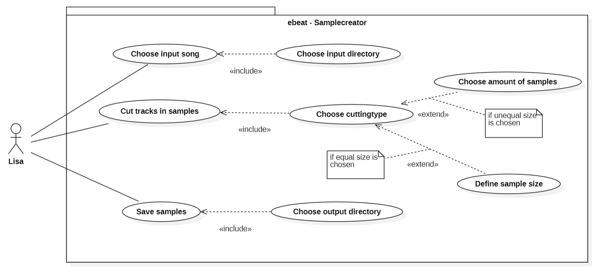
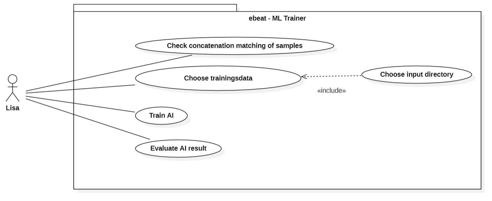
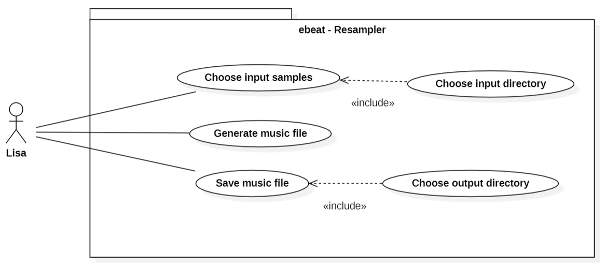
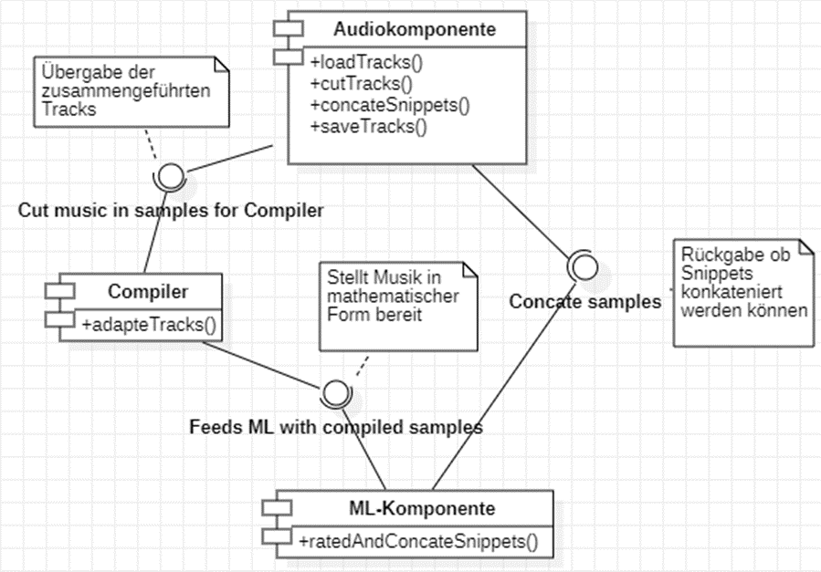
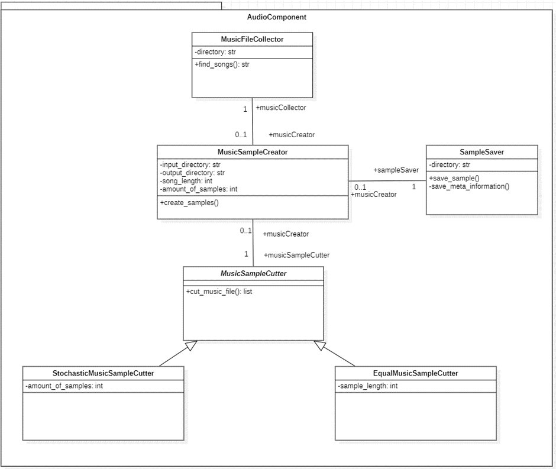
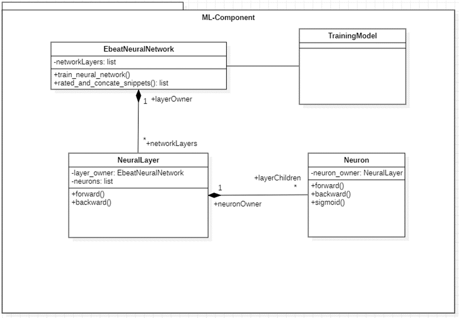
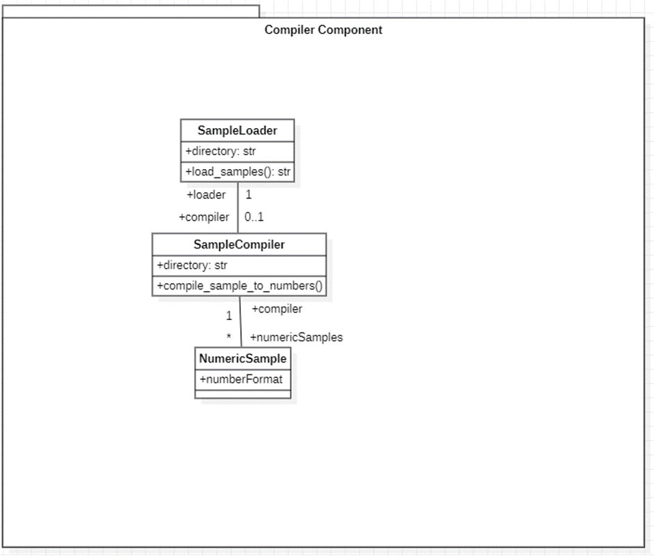

# <h1>ebeat project</h1>
Projektmanagement: [Trello Board](https://trello.com/b/HYG7tuaq/tech-lab) 

Patrick Treiber 42609

Michael Henn 42595 

Vanessa Hartmann 42580 

Nicola Haller 42617 

Sascha Fuska 42590 

Arline Carle 42582 

## <h2> Anforderunsganalyse </h2>
### <h3> Ziel der Anforderung: </h3>
Das Ziel der zu entwickelnden Maschine ist, dass sie automatisiert Musik zusammenstellt.

### <h3> Anwendungsbereich:  </h3>

Der Anwendungsbereich einer zu entwickelnden KI ist, dass die KI selbstständig (automatisiert) Musikstücke zerlegt und wieder zu neuen Musikstücken zusammenstellt.  

### <h3>Use Case   </h3> 

<U><h4> ebeat – Samplecreator </h4></U>

**Name Use Case:** Choose input song 
**Akteur:** Lisa 
**Ziel:** Lisa kann einen bestimmten Song auswählen. 
**Vorbedingung:** Es muss eine Audiodatei (wav/mp3) in einem Pfad vorliegen.  
**Nachbedingung:** Der Pfad wurde ausgewählt, die Datei liegt zum Einspielen bereit.  
**Standardablauf:**  1. Lisa öffnet die Nutzeroberfläche des Systems.  2. Lisa gibt den Befehl in die Nutzeroberfläche ein, der es ermöglicht einen Inputpfad anzugeben.  3. Lisa trägt den Input Pfad ein und drück Eingabe (Enter).  

**Name Use Case:** Cut tracks in sample 
**Akteur:** Lisa 
**Ziel:** Erstellung von Samples aus einem Musikstück.  
**Vorbedingung:** Es müssen einer oder mehrere Songs im ausgewählten Input Pfad hinterlegt sein. Es muss bestimmt sein, welche Art von Cutting angewendet werden soll und welche Parameter gewünscht sind (Samplegröße oder Sampleanzahl). 
**Nachbedingung:** Musikstücke wurden in einzelne Samples zerlegt.  
**Standardablauf:**  1. Lisa öffnet die Nutzeroberfläche des Systems.  2. Lisa wählt die Songs aus, die zerlegt werden sollen.  3. Lisa gibt an, mit welcher Methodik zerlegt werden soll.  4. Lisa startet den Vorgang. 

**Name Use Case:** Save samples  
**Akteur:** Lisa 
**Ziel:** Lisa möchte die Samples an einem bestimmten Pfad ablegen. 
**Vorbedingung:** Output Pfad muss vorhanden sein. 
**Nachbedingung:** Musik Samples liegen im Output Pfad bereit. 
**Standardablauf:**  1. Lisa öffnet die Nutzeroberfläche des Systems.  2. Lisa gibt den Befehl in die Nutzeroberfläche ein, der es ermöglicht einen Output Pfad anzugeben.  3. Lisa trägt den Output Pfad ein und drück Eingabe (Enter). 
 
 

 #### <h4><U> ebeat – ML Trainer </h4></U>

**Name Use Case:** Check concatenation matching of samples 
**Akteur:** Lisa  
**Ziel:** Harmonie zwischen den einzelnen Samples überprüfen.  
**Vorbedingung:**  Samples müssen aus dem Output Pfad (Save Samples) gelesen werden können.  
**Nachbedingung:** Musikstücke wurden auf Harmonisierung geprüft.  
**Standardablauf:**  1. Lisa gibt den Output Pfad der gespeicherten Samples an.   2. Lisa startet den ML- Algorithmus.  

**Name Use Case:** Choose trainingsdata  
**Akteur:** Lisa  
**Ziel:** Trainingsdaten werden für den ML-Algorithmus festgelegt.  
**Vorbedingung:** Samples für das Training müssen im Output Pfad vorliegen.  
**Nachbedingung:** Trainingsdaten Samples ausgewählt.   
**Standardablauf:**  1. Die Sample Dateien werden im Output Pfad (Samples) ausgewählt.  

**Name Use Case:** Train AI  
**Akteur:** Lisa  
**Ziel:** Die ML-Modell durchläuft den Lernalgorithmus, erstellt und speichert ein Modell.  
**Vorbedingung:**  Samples für das Training müssen im Output Pfad (Samples) ausgewählt sein.  
**Nachbedingung:** Modell erstellt, kann für weitere Input Samples wiederverwendet werden. 
**Standardablauf:**  1. ML-Modell zieht die Samples Dateien aus dem Output Pfad.  2. ML-Modell trainiert anhand des Lernalgorithmus. 3. Modell wird erstellt und gespeichert. 

**Name Use Case:** Evaluate AI result  
**Akteur:** Lisa  
**Ziel:** Bewertung des erstellten Modells aus dem Schritt Train AI.  
**Vorbedingung:**  Das Modell wurde trainiert und erstellt (gespeichert).  
**Nachbedingung:**  Das Modell wurde evaluiert.  
**Standardablauf:**  1. Lisa prüft die Temporäre Musikdatei auf Hörbarkeit.  2. Lisa bewertet das Modell und startet bei Nichtgefallen einen erneuten Trainingsdurchlauf (Train AI). 
 
 

#### <h4><U> ebeat-Resampler </h4></U>

**Name Use Case:** Choose input samples  
**Akteur:** Lisa  
**Ziel:** Auswählen mehrerer Samples, um diese harmonisiert zusammenzuführen.  
**Vorbedingung:**  Es müssen mehrere Audiosamples in einem Pfad vorliegen.  
**Nachbedingung:** Die fertige Audiodatei / Stream liegt im ausgewählten Directory zum Abspielen bereit.  
**Standardablauf:**  1. Lisa öffnet den Resampler.  2. Lisa gibt den Befehl in die Nutzeroberfläche ein, der es ermöglicht einen Input Pfad anzugeben.  3. Lisa trägt den Input Pfad ein und drückt Eingabe (Enter).  4. Lisa startet den Resampler und erstellt eine Audiodatei / Stream.  

**Name Use Case:** Generate music file  
**Akteur:** Lisa  
**Ziel:** System kreiert anhand der zusammengeführten Samples eine Musik Datei.  
**Vorbedingung:**  Es müssen mehrere Samples im ausgewählten Input directory hinterlegt sein, damit diese nacheinander verkettet werden können. Das Trainingsmodell muss erstellt sein.  
**Nachbedingung:** Aus den Samples wurde eine Musikdatei / Stream erstellt.  
**Standardablauf:**  1. Lisa öffnet den Resampler und lässt das ML-Modell die vorher ausgewählten Samples zu einem Musikstück komponieren/ aneinanderreihen.  

**Name Use Case:** Save music file  
**Akteur:** Lisa 
**Ziel:** Lisa legt das Musikstück in einem bestimmten Pfad ab.  
**Vorbedingung:** Output Directory muss vorhanden sein. Audiodatei / Stream muss vorhanden sein.  
**Nachbedingung:** Generiertes Musikstück wurde gespeichert.  
**Standardablauf:**  1. Lisa öffnet den Resampler.  2. Lisa gibt den Befehl in die Nutzeroberfläche ein, der es ermöglicht einen Output Pfad anzugeben. 3. Lisa trägt den Output Pfad ein und drückt Eingabe (Enter).  4. Daraufhin wird das Musikstück gespeichert und ist zum Abhören bereit.  
## <h2> Systemarchitektur</h2>
### <h3>Komponentendiagramm  </h3>

### <h3>Klassendiagramm  </h3>
#### <h4><U> Audio Component </h4></U>

#### <h4><U> ML-Component </h4></U>

#### <h4><U> Complier Component </h4></U>

## <h2>Theoretische Grundlagen</h2>

## <h2> Systemspezifikation</h2>

