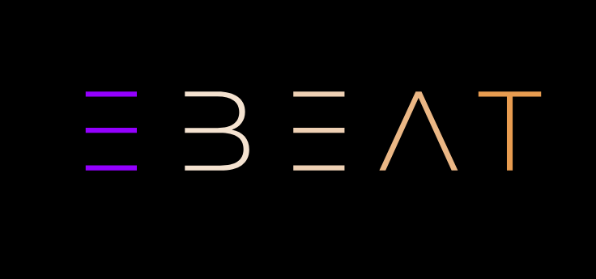
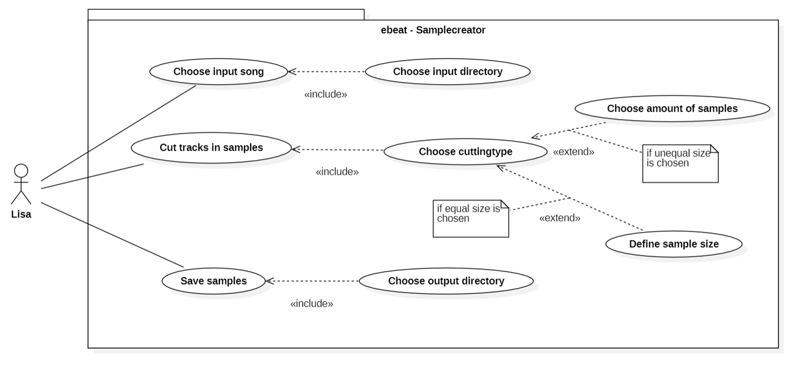
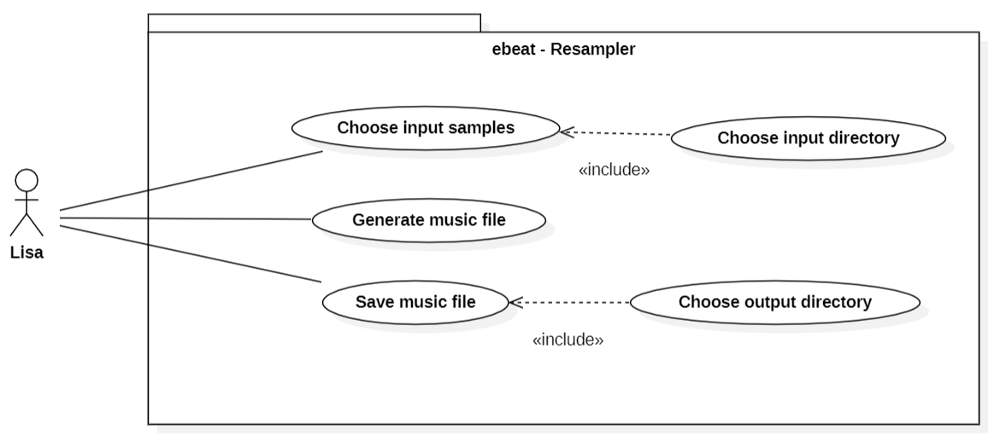
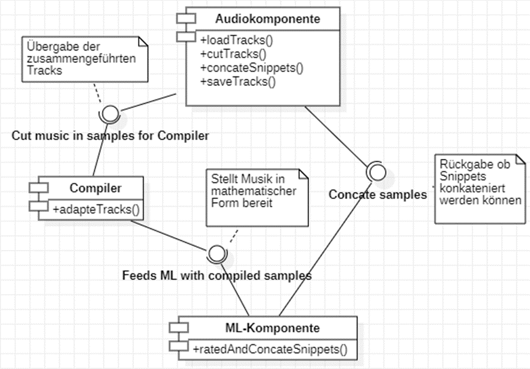
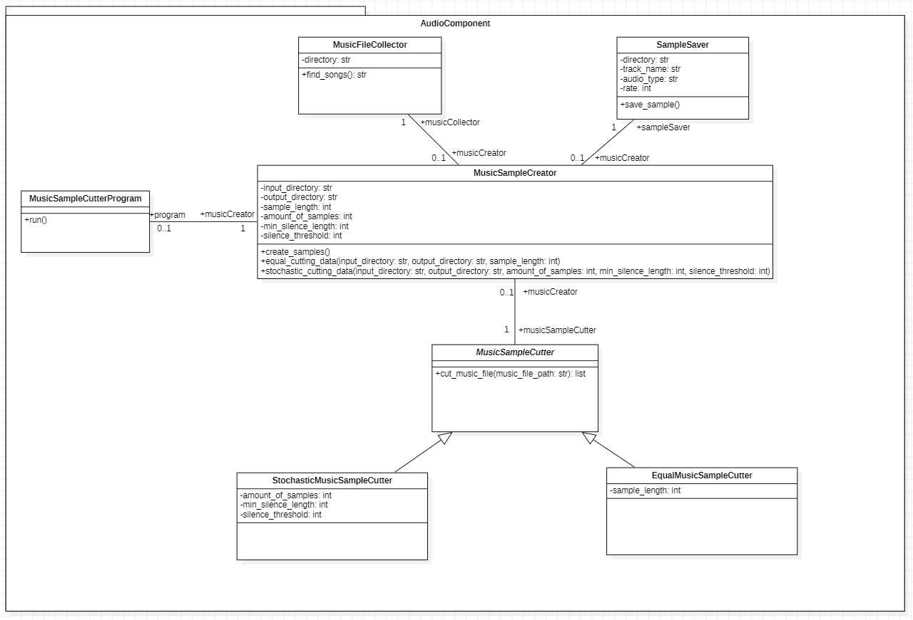
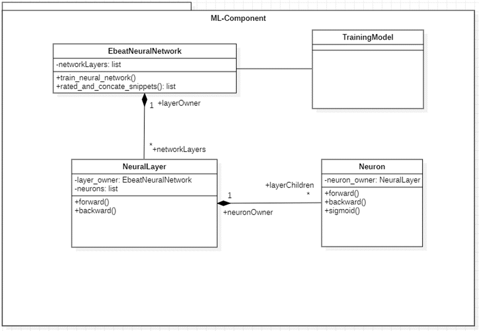
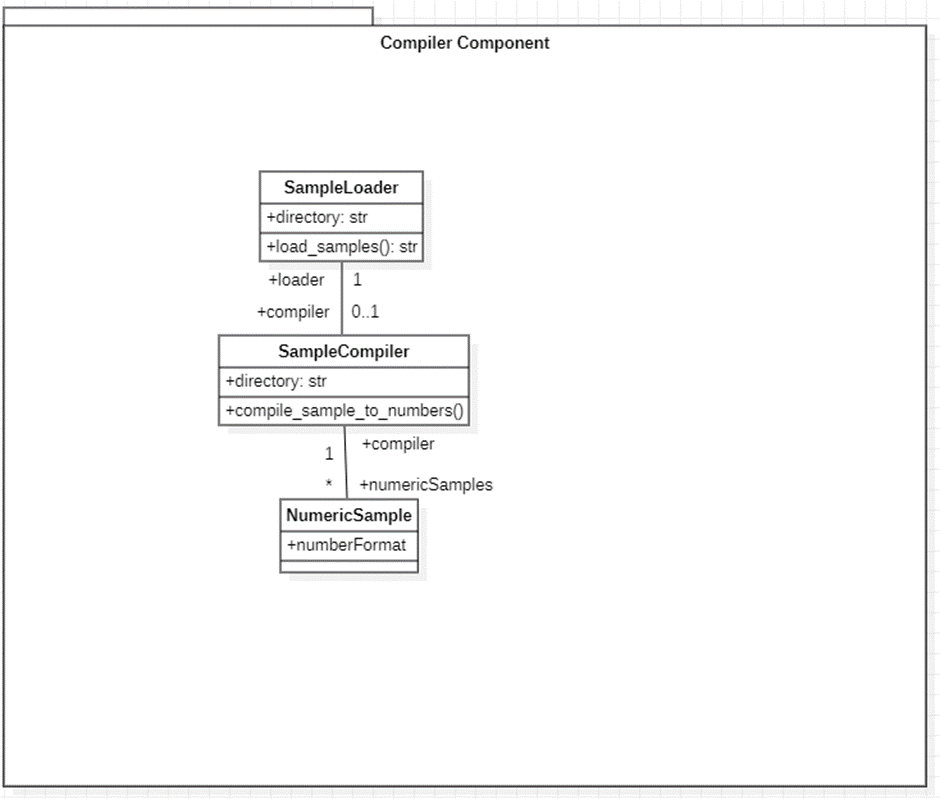

# ebeat project

Projektmanagement: [Trello Board](https://trello.com/b/HYG7tuaq/tech-lab) 

Patrick Treiber 42609

Michael Henn 42595 

Vanessa Hartmann 42580 

Nicola Haller 42617 

Sascha Fuksa 42590 

Arline Carle 42582 

##  Anforderunsganalyse 
###  Ziel der Anforderung: 
Das Ziel der zu entwickelnden Maschine ist, dass sie automatisiert Musik zusammenstellt.

###  Anwendungsbereich:  

Der Anwendungsbereich einer zu entwickelnden KI ist, dass die KI selbstständig (automatisiert) Musikstücke zerlegt und wieder zu neuen Musikstücken zusammenstellt.  

### Use Case    

<U> ebeat – Samplecreator </U>

**Name Use Case:** Choose input song 
**Akteur:** Lisa 
**Ziel:** Lisa kann einen bestimmten Song auswählen. 
**Vorbedingung:** Es muss eine Audiodatei (wav/mp3) in einem Pfad vorliegen.  
**Nachbedingung:** Der Pfad wurde ausgewählt, die Datei liegt zum Einspielen bereit.  
**Standardablauf:**  1. Lisa öffnet die Nutzeroberfläche des Systems.  2. Lisa gibt den Befehl in die Nutzeroberfläche ein, der es ermöglicht einen Inputpfad anzugeben.  3. Lisa trägt den Input Pfad ein und drück Eingabe (Enter).  

**Name Use Case:** Cut tracks in sample 
**Akteur:** Lisa 
**Ziel:** Erstellung von Samples aus einem Musikstück.  
**Vorbedingung:** Es müssen einer oder mehrere Songs im ausgewählten Input Pfad hinterlegt sein. Es muss bestimmt sein, welche Art von Cutting angewendet werden soll und welche Parameter gewünscht sind (Samplegröße oder Sampleanzahl). 
**Nachbedingung:** Musikstücke wurden in einzelne Samples zerlegt.  
**Standardablauf:**  1. Lisa öffnet die Nutzeroberfläche des Systems.  2. Lisa wählt die Songs aus, die zerlegt werden sollen.  3. Lisa gibt an, mit welcher Methodik zerlegt werden soll.  4. Lisa startet den Vorgang. 

**Name Use Case:** Save samples  
**Akteur:** Lisa 
**Ziel:** Lisa möchte die Samples an einem bestimmten Pfad ablegen. 
**Vorbedingung:** Output Pfad muss vorhanden sein. 
**Nachbedingung:** Musik Samples liegen im Output Pfad bereit. 
**Standardablauf:**  1. Lisa öffnet die Nutzeroberfläche des Systems.  2. Lisa gibt den Befehl in die Nutzeroberfläche ein, der es ermöglicht einen Output Pfad anzugeben.  3. Lisa trägt den Output Pfad ein und drück Eingabe (Enter). 
 
 

 #### <U> ebeat – ML Trainer </U>

**Name Use Case:** Check concatenation matching of samples 
**Akteur:** Lisa  
**Ziel:** Harmonie zwischen den einzelnen Samples überprüfen.  
**Vorbedingung:**  Samples müssen aus dem Output Pfad (Save Samples) gelesen werden können.  
**Nachbedingung:** Musikstücke wurden auf Harmonisierung geprüft.  
**Standardablauf:**  1. Lisa gibt den Output Pfad der gespeicherten Samples an.   2. Lisa startet den ML- Algorithmus.  

**Name Use Case:** Choose trainingsdata  
**Akteur:** Lisa  
**Ziel:** Trainingsdaten werden für den ML-Algorithmus festgelegt.  
**Vorbedingung:** Samples für das Training müssen im Output Pfad vorliegen.  
**Nachbedingung:** Trainingsdaten Samples ausgewählt.   
**Standardablauf:**  1. Die Sample Dateien werden im Output Pfad (Samples) ausgewählt.  

**Name Use Case:** Train AI  
**Akteur:** Lisa  
**Ziel:** Die ML-Modell durchläuft den Lernalgorithmus, erstellt und speichert ein Modell.  
**Vorbedingung:**  Samples für das Training müssen im Output Pfad (Samples) ausgewählt sein.  
**Nachbedingung:** Modell erstellt, kann für weitere Input Samples wiederverwendet werden. 
**Standardablauf:**  1. ML-Modell zieht die Samples Dateien aus dem Output Pfad.  2. ML-Modell trainiert anhand des Lernalgorithmus. 3. Modell wird erstellt und gespeichert. 

**Name Use Case:** Evaluate AI result  
**Akteur:** Lisa  
**Ziel:** Bewertung des erstellten Modells aus dem Schritt Train AI.  
**Vorbedingung:**  Das Modell wurde trainiert und erstellt (gespeichert).  
**Nachbedingung:**  Das Modell wurde evaluiert.  
**Standardablauf:**  1. Lisa prüft die Temporäre Musikdatei auf Hörbarkeit.  2. Lisa bewertet das Modell und startet bei Nichtgefallen einen erneuten Trainingsdurchlauf (Train AI). 
 
 

#### <U> ebeat-Resampler </U>

**Name Use Case:** Choose input samples  
**Akteur:** Lisa  
**Ziel:** Auswählen mehrerer Samples, um diese harmonisiert zusammenzuführen.  
**Vorbedingung:**  Es müssen mehrere Audiosamples in einem Pfad vorliegen.  
**Nachbedingung:** Die fertige Audiodatei / Stream liegt im ausgewählten Directory zum Abspielen bereit.  
**Standardablauf:**  1. Lisa öffnet den Resampler.  2. Lisa gibt den Befehl in die Nutzeroberfläche ein, der es ermöglicht einen Input Pfad anzugeben.  3. Lisa trägt den Input Pfad ein und drückt Eingabe (Enter).  4. Lisa startet den Resampler und erstellt eine Audiodatei / Stream.  

**Name Use Case:** Generate music file  
**Akteur:** Lisa  
**Ziel:** System kreiert anhand der zusammengeführten Samples eine Musik Datei.  
**Vorbedingung:**  Es müssen mehrere Samples im ausgewählten Input directory hinterlegt sein, damit diese nacheinander verkettet werden können. Das Trainingsmodell muss erstellt sein.  
**Nachbedingung:** Aus den Samples wurde eine Musikdatei / Stream erstellt.  
**Standardablauf:**  1. Lisa öffnet den Resampler und lässt das ML-Modell die vorher ausgewählten Samples zu einem Musikstück komponieren/ aneinanderreihen.  

**Name Use Case:** Save music file  
**Akteur:** Lisa 
**Ziel:** Lisa legt das Musikstück in einem bestimmten Pfad ab.  
**Vorbedingung:** Output Directory muss vorhanden sein. Audiodatei / Stream muss vorhanden sein.  
**Nachbedingung:** Generiertes Musikstück wurde gespeichert.  
**Standardablauf:**  1. Lisa öffnet den Resampler.  2. Lisa gibt den Befehl in die Nutzeroberfläche ein, der es ermöglicht einen Output Pfad anzugeben. 3. Lisa trägt den Output Pfad ein und drückt Eingabe (Enter).  4. Daraufhin wird das Musikstück gespeichert und ist zum Abhören bereit.  
##  Systemspezifikation
### Komponentendiagramm  

Das Komponenten Diagramm dient zur übersichtlichen Darstellung der einzelnen Teilkomponenten des Gesamtsystems. Die Audiokomponente ist zuständig für die Verarbeitung von Musikformaten. Sie kann diese laden, speichern und verarbeiten. Der Compiler, welche über eine Schnittstelle mit der Audiokomponente verbunden ist, wandelt die Audiodateien in ein geeignetes Zahlenformat um. Die letzte Komponente unseres Gesamtsystem, die ML-Komponente, ist in der Lage ein Modell zu trainieren, welches Samples bewertet und Feedback an die Audiokomponente hinsichtlich ihrer Eignung der Konkatenation. 
### Klassendiagramm  
#### <U> Audio Component </U>

Das Klassendiagramm ”Audio Component” bildet die Klassen MusicSampleCreator, MusicFileCollector, SampleSaver sowie die abstrakte Klasse MusicSampleCutter und ihre beiden erbenden Klassen StochasticMusicSampleCutter und EqualMusicSampleCutter ab. In der Klasse MusicSampleCreator werden die Samples erstellt, dafür ruft sie die jeweiligen Methoden der weiteren Klassen auf. Über die Klasse MusicFileCollector werden die Inputtracks geladen. Die Klasse SampleSaver speichert die Samples und die Metadaten. Die beiden erbenden Klassen der abstrakten Klasse MusicSampleCutter schneiden die Tracks in Samples. Die Zerschneidung der Tracks in Samples erfolgt entweder äquidistant oder nach stochastischem Ansatz.  
- Laden der Audio-Files  
- Audio-Files müssen sinnvoll geteilt werden (Samples), manuell oder stochastisch 
- Nummerierung/Benennung für Zuordnung der Audio-Files notwendig 
- Samples müssen zu einem Stream/Audio-File zusammengesetzt werden können 
- Speicherung des Audio Streams/Audio-Files 
- Kann Audio-Files (WAV/MP3 -> Format egal) verwenden 
- Audioeigenschaften können analysiert werden -> Metadaten 
- Erzeugung eines Streams/Audio-Files (Reihenfolge) anhand einzelner Samples  
- Speichern der Audiofiles 
#### <U> ML-Component </U>

Das ML-Komponente beinhaltet Klassen, die ein neuronales Netzwerk abbilden. Dazu gehören die Klassen NeuralLayer und Neuron. Die Klasse EbeatNeuralNetwork trainiert das neuronale Netz und entscheidet welche Samples zueinander passen. Trainiert wird das Trainingsmodell, das am Ende Grundlage für die Entscheidungsfindung ist. 
- Samples werden in mathematischer Form = Zahlenformat konvertiert (Tabelle/Matrix) 
- Übersetzt Samples anhand eines geeigneten Formates -> Tensor für ML-Komponente 
- Leitet die übersetzten Formate an ML-Komponente weiter 
#### <U> Complier Component </U>

Die Compiler-Komponente dient zu Übersetzung der Musikformate. Darin sind die Klassen SampleLoader, welcher die Samples aus einem bestimmten Pfad lädt. Die Klasse SampleCompiler nimmt die Übersetzung in ein nummerisches Format vor. 
- Lernalogrythmus identifizieren und bewertet ob einzelne Samples harmonieren -> Notwendig für das Erstellen des Streams/Audio-Files, dies muss von Audio-Komponente rückgemeldet werden um die einzelnen Samples zusammenzuführen 
- RNN / LSTM wird anhand Tensorflow Machine Learning Plattform umgesetzt 
- Audioeigenschaften (Amplitude -> Lautstärke, Wellenlänge -> Schnelligkeit, Phase -> Verschiebung) werden sinnvoll betrachtet und ggf. verwendet 
- Speicherung der neuen Musikstücke 
## Theoretische Grundlagen
Mit Hilfe eines neuronalen Netzwerks, ist es möglich einer Maschine etwas
anzutrainieren. Dieses besteht aus zwei wesentlichen Bestandteilen:

-   Neuron: Ein Knoten mit Gewichtung, Bias und Aktivierungsfunktion, mit der
    berechnet wird, ob das Neuron “feuert”. Beispiele für Aktivierungsfunktionen
    sind RELU, Sigmoid und Tanh

-   Layer: Eine Sammlung von Neuron. Dabei unterscheidet man zwischen Input-,
    Output, und Hiddenlayer. Verfügt das Netzwerk über mehr als ein Hiddenlayer,
    spricht man von deep learning.

Das Erstellen eines neuronalen Netzwerks kann beispielweise mit TensorFlow und
Keras erfolgen. TensorFlow ist ein Framework und Keras die Bibliothek, die eine
Schnittstelle bereitstellt.

In der Dokumentation von TensorFlow gibt es bereits einen beschriebenen
Anwendungsfall, bei dem versucht wird Musik zu erzeugen. Dafür wird ein RNN
aufgebaut, mit dem ein Modell trainiert auf Basis von Piano MIDI Files.

In einem zweiten Anwendungsfall wir mit der LSTM Architektur und einem RNN ein
Modell trainiert, welches Musik generieren kann. Für das Training wird ein
Datensatz von tausenden Irischen Volkslieder verwendet, das in der ABC Notation
vorliegt.

Pydub wurde im Verlauf der Entwicklung für das Zerstückeln ausgewählt, damit ein
stochastischer Ansatz implementiert werden konnte. Hierbei wird anhand von
leisen stellen (definierbar) ein Teilen der Audio Datei vorgenommen. Pydub
ermöglicht weitere Audio manipulationen in Form von Faden, Lautsärkeänderung
etc.

Für das aufteilen in gleich große Stücke wurde die SciPy Bibliothek verwendet.
Der User kann Anhand einer Eingabe die fixe größe der Samples auswählen. SciPy
basiert auf NumPy und wandelt die Audio Daten in ein zahlenbasiertes Format.

-   Die Verwaltung und Dokumentation der Arbeitsschritte finden über GitHub
    statt.

-   Für zusätzliche textuelle Beschreibungen werden Mark-Down-Files verwendet.

-   Die Software Struktur wird mit Hilfe von Unified Modeling Language (UML)
    dargestellt. Hierfür wurden Klassendiagramme, Use Case Diagramme sowie ein
    Komponentendiagramm erstellt. Diese wurden mit der Software StarUML
    erstellt. Die Modellierung der Diagramme stützt sich auf die Literatur von
    Oestereich et al. (Analyse und Design mir der UML 2.5).

Literaturverzeichnis:

AudioAnalysis. (o. D.). <https://cs.marlboro.college>. Abgerufen am 5. April
2022, von
<https://cs.marlboro.college/cours/spring2018/jims_tutorials/computational_science/feb26.attachments/AudioAnalysis.html>

Bullock, J. (2021, 13. Dezember). *Simple Audio Processing in Python With Pydub
\- Better Programming*. Medium. Abgerufen am 3. April 2022, von
<https://betterprogramming.pub/simple-audio-processing-in-python-with-pydub-c3a217dabf11>

Chauhan, N. S. (o. D.). *Audio Data Analysis Using Deep Learning with Python
(Part 1)*. KDnuggets. Abgerufen am 5. April 2022, von
<https://www.kdnuggets.com/2020/02/audio-data-analysis-deep-learning-python-part-1.html>

D. (2018). Deep Learning in Natural Language Processing (1st ed. 2018 Aufl.)
[E-Book]. Springer.

datacamp. (o. D.). Using TensorFlow 2.0 to Compose Music Tutorial. DataCamp
Community. Abgerufen am 2. April 2022, von
<https://www.datacamp.com/community/tutorials/using-tensorflow-to-compose-music>

Frochte, J. (2020). Maschinelles Lernen: Grundlagen und Algorithmen in Python
(3., überarbeitete und erweiterte Aufl.). Carl Hanser Verlag GmbH & Co. KG.

Google Colaboratory - Introduction to Deep Learning. (o. D.).
<Https://Colab.Research.Google.Com>. Abgerufen am 3. April 2022, von
<https://colab.research.google.com/github/aamini/introtodeeplearning/blob/master/lab1/solutions/Part2_Music_Generation_Solution.ipynb>

Kersting, K., Lampert, C. & Rothkopf, C. (2019). *Wie Maschinen lernen:
Künstliche Intelligenz verständlich erklärt* (1. Aufl. 2019 Aufl.) [E-Book].
Springer. Abgerufen am 24. März 2022, von
<https://link.springer.com/chapter/10.1007/978-3-658-26763-6_3>

Kleesiek, J., Kaissis, G., Strack, C., Murray, J. M. & Braren, R. (2019). *Wie
funktioniert maschinelles Lernen?* Springer Medizin Verlag.
<https://doi.org/10.1007/s00117-019-00616-x>

Kofler, M. (2021, März). tensorflow-music-generator Public. GitHub. Abgerufen
am 2. April 2022, von
<https://github.com/burliEnterprises/tensorflow-music-generator>

Oestereich, B., Scheithauer, A. & Bremer, S. (2013). *Analyse und Design mit der
UML 2.5: Objektorientierte Softwareentwicklung* (11., umfassend überarbeitete
und aktualisierte Aufl.). De Gruyter Oldenbourg.

Russell, S. & Norvig, P. (2012). *Künstliche Intelligenz: Ein moderner Ansatz
(Pearson Studium - IT)* (3., aktualisierte Aufl.) [E-Book]. Pearson Studium ein
Imprint von Pearson Deutschland.

TensorFlow. (o. D.-a). Generate music with an RNN \| TensorFlow Core.
Abgerufen am 1. April 2022, von
<https://www.tensorflow.org/tutorials/audio/music_generation>

TensorFlow. (o. D.-b). Pitch Detection with SPICE \| TensorFlow Hub. Abgerufen
am 3. April 2022, von <https://www.tensorflow.org/hub/tutorials/spice>

TensorFlow. (o. D.-c). tfio.audio.decode_mp3 \| TensorFlow I/O. Abgerufen am
1\. April 2022, von
[https://www.tensorflow.org/io/api_docs/python/tfio/audio/decode_mp3\#args](https://www.tensorflow.org/io/api_docs/python/tfio/audio/decode_mp3#args)

Tutorialink. (o. D.). Split audio files using silence detection – Python.
Tutorialink.Com. Abgerufen am 6. April 2022, von
<https://python.tutorialink.com/split-audio-files-using-silence-detection/>

